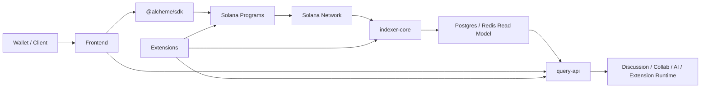

# Alcheme Protocol

[简体中文](README.zh-CN.md)

Alcheme is an open-source Solana-native social and knowledge protocol that is trying to preserve discussion, turn it into structured knowledge, and make contribution more traceable.

It is trying to build a structure where valuable discussion does not disappear into feed logic, where knowledge can gradually become a path, and where contribution can remain visible instead of being flattened into a final result.

This repository is the main implementation monorepo for that direction. It contains the Solana programs, frontend, SDK, indexing/query services, and official extensions behind the current product path that already exists in code today:

`circle discussion -> draft collaboration -> crystallized knowledge`

This repository is still being prepared for open collaboration. For the first public snapshot, this `README` should work as the smallest accurate entry point: what Alcheme is trying to do, what this codebase already contains, how to run it locally, and where the current boundaries still are.

## What Alcheme Is Trying To Do

At the product level, Alcheme is not trying to become just another louder social app or a static knowledge base.

The direction is closer to this:

- let discussion inside circles stay alive long enough to matter
- let that discussion move into drafts instead of disappearing into time flow
- let mature drafts crystallize into knowledge that can be revisited, cited, and extended
- let contribution and provenance remain visible across that process

This repo should be read in that light: it is not only protocol infrastructure, and it is not only frontend code. It is the implementation of that full path.

## What This Repo Contains Today

- Solana / Anchor programs for identities, circles, content, and protocol-side authority
- A Next.js frontend with the current product surfaces around circles, discussion, drafts, knowledge, and summary
- `query-api` for GraphQL, REST, discussion runtime, collab, and extension-facing APIs
- `indexer-core` for on-chain event ingestion and read-model projection
- `@alcheme/sdk`
- Official extensions and extension-side services
- Local scripts for full-stack development, protocol deployment, and consistency checks

## Current Product Reality

This repo is not just protocol scaffolding. The current codebase already includes real product surfaces and flows, including:

- circles with Plaza / Crucible / Sanctuary tabs
- discussion and feed flows
- draft collaboration and ghost-draft-related workflows
- crystallization and `/knowledge/:id`
- summary pages and supporting read-model infrastructure

The current execution phase is still **Phase 1: MVP social core**. In other words, the repo already contains a real path from discussion toward retained knowledge, but it does not yet represent the full end state of the project.

Some important capabilities are still in progress rather than finished, especially:

- contribution weight MVP production acceptance
- fuller provenance / lineage replay UX
- stricter end-to-end hard gates in some crystallization paths

For the first public snapshot, treat this `README`, [CONTRIBUTING.md](./CONTRIBUTING.md), and the included schema files under `docs/schemas/` as the public documentation baseline.

The internal source tree still contains a wider planning and runbook surface, but those materials are intentionally not part of the first public export.

## Quickstart

### Prerequisites

- Node.js 20+
- npm 10+
- Rust stable toolchain
- Solana CLI 3.0.11
- Anchor CLI 0.31.1
- surfpool
- Docker (for local Postgres / Redis and supporting services)

This workspace is currently validated against the toolchain matrix above. Anchor `0.31.1` officially recommends Solana `2.1.0`, but this repo's current dependency graph does not build cleanly against that older bundled Rust toolchain.

### Minimal Local Flow

1. Install root dependencies:

   ```bash
   npm ci
   ```

2. Install package-specific dependencies where needed:

   ```bash
   cd frontend && npm ci
   cd sdk && npm ci
   cd services/query-api && npm ci
   ```

3. Start the local full stack:

   ```bash
   bash scripts/start-local-stack.sh
   ```

   The local stack script is the preferred entry point. It brings up the developer runtime around Surfpool, protocol deployment checks, Postgres, Redis, `query-api`, the contribution tracker, `indexer-core`, and the frontend.

4. If you only need to redeploy local programs, run:

   ```bash
   bash scripts/deploy-local-optimized.sh
   ```

5. Run the narrowest checks that match your change:

   ```bash
   npm run check:covenant
   npm run validate:extension-manifest
   npm run audit:licenses
   ```

   Then, as needed:

   ```bash
   cd frontend && npm run test:ci && npm run typecheck && npm run build
   cd sdk && npm test && npm run build
   cd services/query-api && npm test && npm run build
   cd services/indexer-core && cargo test
   ```

The local stack scripts remain the supported way to boot the developer runtime. Additional internal runbooks exist in the source tree, but they are intentionally not part of the first public snapshot.

## Architecture



Architecturally, the repo still distinguishes between public-safe read surfaces and more runtime-heavy/private-capability surfaces. In local development, `start-local-stack.sh` intentionally runs a developer-friendly consolidated shape; do not treat that convenience topology as proof that the production architecture is a single unified public node.

## Repository Layout

- `programs/`: Solana / Anchor protocol programs
- `shared/`, `cpi-interfaces/`: shared types and CPI interfaces
- `sdk/`: `@alcheme/sdk`
- `frontend/`: Next.js web client
- `mobile-shell/`: Capacitor shell for mobile packaging
- `services/indexer-core/`: Rust indexer
- `services/query-api/`: GraphQL / REST / runtime service
- `extensions/`: official extensions and extension-side services
- `scripts/`: local stack, deployment, consistency, and maintenance scripts
- `docs/schemas/`: public schema and example files carried into the first public snapshot

## Public Snapshot Note

This repository is published from a filtered export of a larger internal source tree.

- some planning docs, runbooks, deployment notes, and internal-only scripts are intentionally absent from the first public snapshot
- public contributors should treat the shipped code, this `README`, [CONTRIBUTING.md](./CONTRIBUTING.md), and the included schema files as the public source of truth

## License

Unless stated otherwise, the code in this repository is licensed under `Apache-2.0`.

Third-party dependency watchlist exceptions for the first public release are tracked in [config/license-audit-policy.json](./config/license-audit-policy.json).
