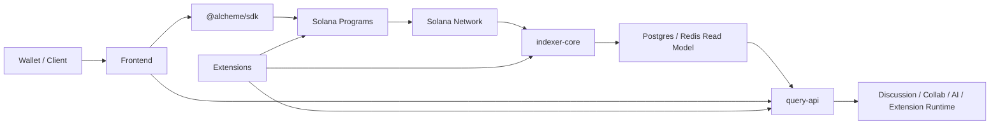

# Alcheme Protocol

[English](README.md)

Alcheme 是一个基于 Solana 的开源社交与知识协议，正在尝试把容易蒸发的讨论变成可沉淀、可回看、可追溯的知识结构。

它想尝试的是另一种结构：让有价值的讨论不那么快蒸发，让知识慢慢形成路径，让贡献在这个过程中尽量保持可见，而不是最后只剩下一个结果和站在结果旁边的人。

这个仓库就是这条方向的主实现 monorepo。它包含了当前 Alcheme 产品路径背后的合约、前端、SDK、索引/查询服务和官方扩展。当前代码里已经存在的那条主路径可以概括成：

`circle discussion -> draft collaboration -> crystallized knowledge`

这个仓库仍在为开源协作做准备。对第一版公开快照来说，这份 `README` 应该承担一个最小但准确的入口作用：先说清楚 Alcheme 想做什么、当前代码已经有什么、如何本地跑起来，以及现在还没做到哪一步。

## Alcheme 想做什么

从产品方向上看，Alcheme 不是普通的社交产品，也不是普通的知识产品。

更接近的说法是：

- 让圈层中的 discussion 不只是出现在时间流里然后消失
- 让 discussion 能进入 draft，而不是刚发生就被时间冲散
- 让成熟的 draft 可以 crystallize 成可回看、可引用、可继续生长的 knowledge
- 让贡献和溯源在这个过程中尽量保持可见

所以看这个仓库时，最好不要把它只理解成“协议基础设施”，也不要只把它理解成“前端项目”。它是在实现这整条路径。

## 当前仓库包含什么

- 负责身份、圈层、内容和协议侧权限的 Solana / Anchor 程序
- 承载圈层、discussion、draft、knowledge、summary 等当前产品面的 Next.js 前端
- `query-api`，用于 GraphQL、REST、discussion runtime、collab 和 extension-facing API
- `indexer-core`，用于链上事件索引和读模型投影
- `@alcheme/sdk`
- 官方扩展与扩展侧服务
- 用于本地全栈开发、协议部署和一致性校验的脚本

## 当前产品现实

这个仓库不只是协议脚手架。当前代码库里已经有真实的产品面和链路，包括：

- 带 Plaza / Crucible / Sanctuary 三个主面的圈层产品结构
- discussion 与 social feed 两套内容流
- draft 协作和 ghost draft 相关流程
- crystallization 与 `/knowledge/:id`
- summary 页面及其背后的读模型基础设施

当前执行阶段仍然是 **Phase 1: MVP 社交核心**。也就是说，这个仓库已经包含了一条从 discussion 走向 retained knowledge 的真实路径，但它还不代表项目的完整终局。

一些关键能力仍然在推进中，而不是已经完成，尤其包括：

- contribution weight MVP 的生产验收
- 更完整的 provenance / lineage 回看体验
- 某些 crystallization 路径里更严格的端到端硬门禁

对第一版公开快照来说，请把这份 `README`、[CONTRIBUTING.md](./CONTRIBUTING.md) 和 `docs/schemas/` 下随仓库公开的 schema 文件，当作公开文档基线。

内部源仓库里还有更大的 plans / runbooks 文档面，但这些材料有意没有带入第一版公开导出。

## 快速开始

### 前置依赖

- Node.js 20+
- npm 10+
- Rust stable toolchain
- Solana CLI 3.0.11
- Anchor CLI 0.31.1
- surfpool
- Docker（用于本地 Postgres / Redis 和配套服务）

当前仓库按以上工具链矩阵做验证。虽然 Anchor `0.31.1` 官方推荐 Solana `2.1.0`，但本仓库当前依赖图在那套较老的内置 Rust 工具链上不能稳定构建。

### 最小本地流程

1. 安装根目录依赖：

   ```bash
   npm ci
   ```

2. 按需安装子项目依赖：

   ```bash
   cd frontend && npm ci
   cd sdk && npm ci
   cd services/query-api && npm ci
   ```

3. 启动本地全栈：

   ```bash
   bash scripts/start-local-stack.sh
   ```

   这是推荐入口。这个脚本会拉起围绕 Surfpool、本地部署检查、Postgres、Redis、`query-api`、contribution tracker、`indexer-core` 和 frontend 的开发运行时。

4. 如果你只是需要重部署本地协议程序，可以单独执行：

   ```bash
   bash scripts/deploy-local-optimized.sh
   ```

5. 按改动范围运行最小必要校验：

   ```bash
   npm run check:covenant
   npm run validate:extension-manifest
   npm run audit:licenses
   ```

   然后按需要继续跑：

   ```bash
   cd frontend && npm run test:ci && npm run typecheck && npm run build
   cd sdk && npm test && npm run build
   cd services/query-api && npm test && npm run build
   cd services/indexer-core && cargo test
   ```

本地开发仍以这些脚本为推荐入口。内部源仓库里还有更细的运行说明，但它们有意没有进入第一版公开快照。

## 架构图



从架构上看，仓库仍然区分了 public-safe read surfaces 和更偏 runtime / private capability 的能力面。  
但在本地开发里，`start-local-stack.sh` 会为了开发便利拉起一个更集中、更像 managed-dev 的形态；不要把这种本地便利拓扑误读成生产架构本身就是单节点统一 authority / runtime。

## 仓库结构

- `programs/`: Solana / Anchor 协议程序
- `shared/`, `cpi-interfaces/`: 共享类型与 CPI 接口
- `sdk/`: `@alcheme/sdk`
- `frontend/`: Next.js Web 客户端
- `mobile-shell/`: 用于移动端打包的 Capacitor shell
- `services/indexer-core/`: Rust 索引器
- `services/query-api/`: GraphQL / REST / runtime 服务
- `extensions/`: 官方扩展与扩展侧服务
- `scripts/`: 本地全栈、部署、一致性和维护脚本
- `docs/schemas/`: 第一版公开快照中携带的 schema 与示例文件

## 公开快照说明

这个仓库是从更大的内部源仓库中过滤导出的公开快照。

- 一些计划文档、runbook、部署说明和内部脚本有意没有进入第一版公开快照
- 对公开协作者来说，应以当前公开代码、这份 `README`、[CONTRIBUTING.md](./CONTRIBUTING.md) 和随仓库附带的 schema 文件为公开真相来源

## 许可证

除非另有说明，本仓库代码默认使用 `Apache-2.0` 许可证。

第一版公开发布允许的第三方依赖许可证例外，记录在 [config/license-audit-policy.json](./config/license-audit-policy.json)。
