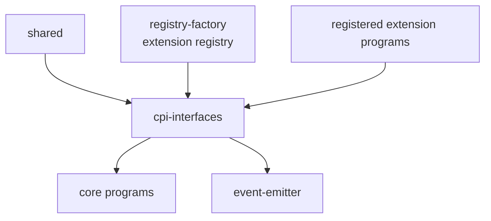
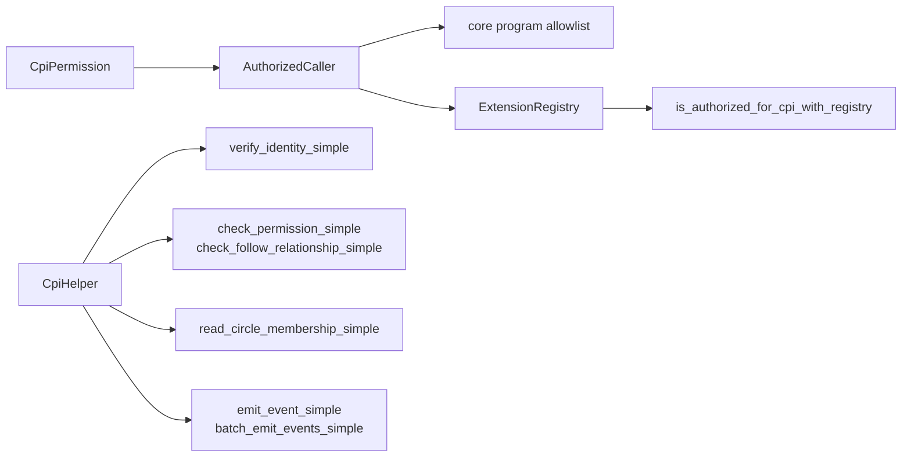

# CPI Interfaces Architecture

HTML diagram: [Open this subproject map](../docs/architecture/subproject-maps.html#cpi-interfaces).

`cpi-interfaces/` defines the CPI permission model and helper calls that let core programs cooperate and let registered extensions call selected base-layer capabilities.

## System Position

## Internal Map

## Responsibility

- Defines CPI permissions such as identity reads, content validation, event emission, reputation writes, contribution reads, and circle extension.
- Provides a hardcoded core-program authorization list for base-layer trust.
- Provides an extension registry path for registered extension programs.
- Provides helper methods used by programs to call identity, access, circle, and event surfaces.

## Entry Points

| Surface | File |
| --- | --- |
| CPI permissions and caller authorization | `cpi-interfaces/src/lib.rs` |
| Extension registry data structure | `cpi-interfaces/src/lib.rs` |
| CPI helper methods | `cpi-interfaces/src/lib.rs` |
| Helper tests | `cpi-interfaces/tests/cpi_helper_tests.rs` |

## Blind Spots To Check

| Question | Evidence Needed |
| --- | --- |
| Which helper calls are real CPI and which are simplified/local helpers? | Inspect each `CpiHelper` implementation in `cpi-interfaces/src/lib.rs`. |
| Which extension permissions are enforced by live instructions? | Trace `is_authorized_for_cpi_with_registry` callers. |
| Which program IDs are canonical after deployment? | Compare `cpi-interfaces/src/lib.rs`, `Anchor.toml`, and `config/devnet-program-ids.json`. |
