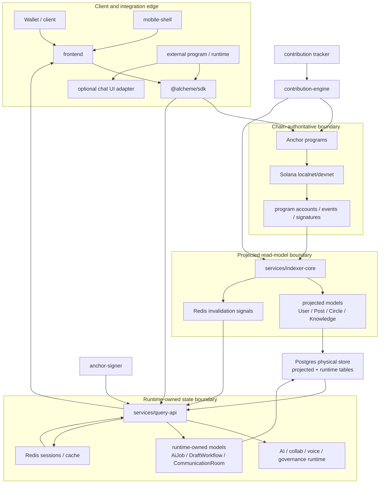
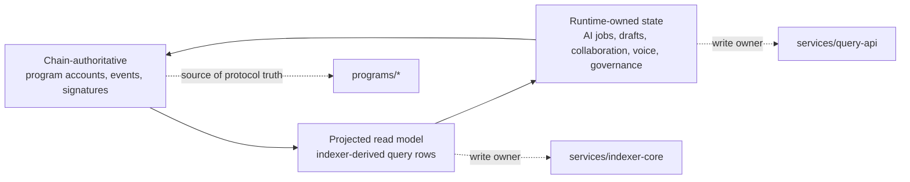
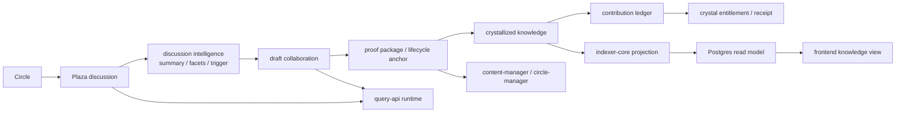
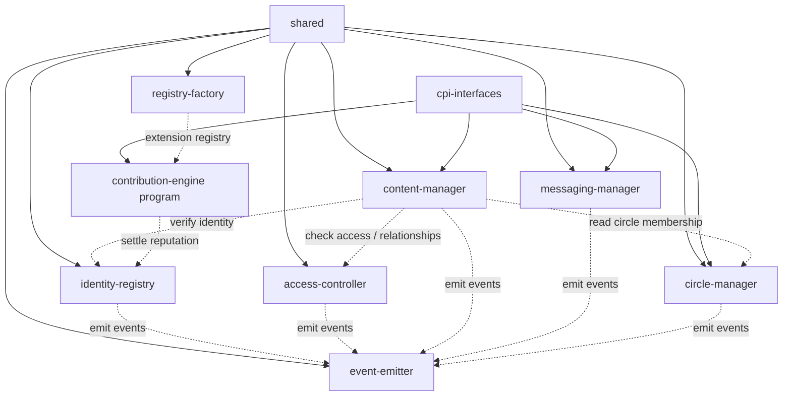
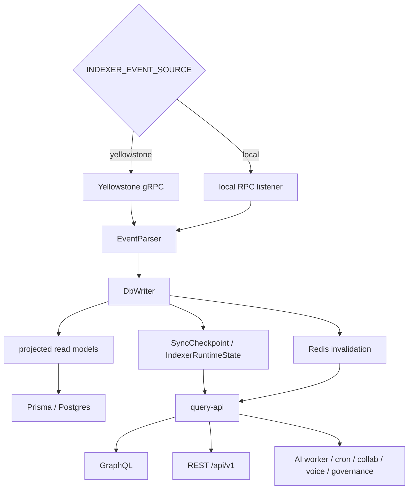
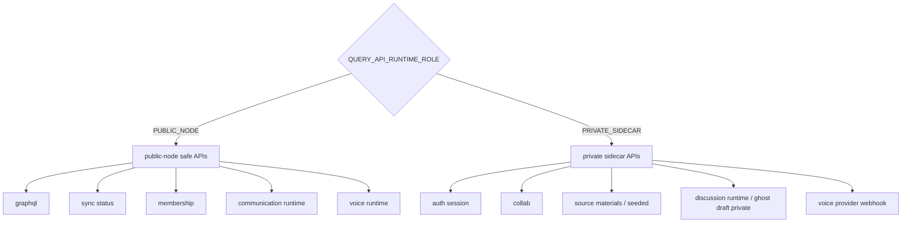
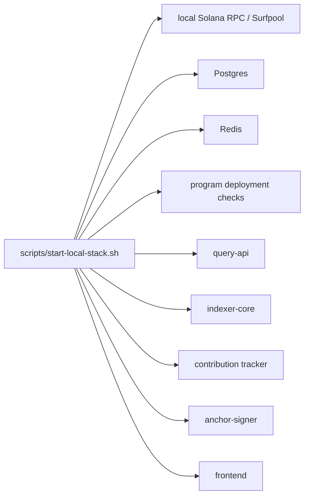

# Alcheme Architecture Guide

This is the diagram-first architecture guide for `alcheme-protocol`. It links the repository's bottom layer programs, projection services, runtime APIs, SDK, frontend, extensions, and local orchestration into one code-backed map.

For the source inventory behind this guide, see [Architecture Inventory](./architecture-inventory.md). For a no-build interactive global map, open [alcheme-architecture-map.html](./alcheme-architecture-map.html). For per-subproject HTML diagrams, open [subproject-maps.html](./subproject-maps.html).

## Global Map

## Layer Index

| Layer | What It Owns | Diagram-First Docs |
| --- | --- | --- |
| Shared foundation | Common Rust types, constants, events, errors, validation, and CPI helpers. | [shared](../../shared/README.md), [cpi-interfaces](../../cpi-interfaces/README.md) |
| On-chain programs | Identity, access, content, events, registry factory, messaging, circles, and contribution extension authority. | [programs](../../programs/README.md), [contribution-engine program](../../extensions/contribution-engine/program/README.md) |
| Projection | Solana event ingestion, parsing, checkpoints, runtime state, read-model writes, and Redis invalidation. | [indexer-core](../../services/indexer-core/README.md) |
| Runtime/API | GraphQL, REST, private sidecar routes, AI jobs, collaboration, voice, governance, drafts, crystallization, and cron workers. | [query-api](../../services/query-api/README.md), [Prisma schema](../../services/query-api/prisma/README.md) |
| Client SDK | Program modules, PDA helpers, transaction helpers, communication runtime clients, and voice runtime clients. | [sdk](../../sdk/README.md) |
| Product UI | Next.js product routes, hooks, API clients, wallet adapters, i18n, browser/mobile runtime integration. | [frontend](../../frontend/README.md), [mobile-shell](../../mobile-shell/README.md) |
| Extensions and examples | Contribution accounting, settlement tracker, memo-anchor signer sidecar, external program communication/voice integration. | [contribution-engine](../../extensions/contribution-engine/README.md), [tracker](../../extensions/contribution-engine/tracker/README.md), [anchor-signer](../../extensions/anchor-signer/README.md), [external program quickstart](../integration/external-program-quickstart.md), [game-chat-react](../../packages/game-chat-react/README.md), [headless example](../../examples/game-chat-headless/README.md) |
| Local orchestration | Local stack startup, Docker services, program deployment, config, covenant checks. | `scripts/start-local-stack.sh`, `docker-compose.yml`, `Anchor.toml`, `package.json` |

## State Authority Boundaries

| Boundary | Source Of Truth | Write Owner | Examples | Main Risk |
| --- | --- | --- | --- | --- |
| Chain-authoritative | Solana accounts, events, and signatures. | Anchor programs and trusted signing flows. | Identity, circle membership anchors, content lifecycle anchors, contribution settlement anchors. | Treating local runtime rows as protocol truth. |
| Projected read model | Deterministic projection from chain activity. | `services/indexer-core`. | User, post, circle, knowledge, sync checkpoint, extension projections. | Silent drift when emitted events and parser coverage diverge. |
| Runtime-owned state | Product state created or reconciled off-chain. | `services/query-api` workers, REST services, and cron jobs. | AI jobs, discussion sessions, draft workflow state, communication rooms, voice sessions, governance workflow rows. | Mixing runtime state with projected facts without marking ownership. |
| Hybrid state | A runtime row that references or finalizes a chain fact. | Usually `query-api`, with chain verification or anchor signatures. | Crystal receipts, governance execution receipts, draft crystallization attempts. | Duplicate authority if the chain anchor and runtime row disagree. |

Reading rule: if a row can be fully rebuilt from chain events, it belongs to the projected read model. If `query-api` creates, schedules, reconciles, or expires it, it is runtime-owned. If a program account, event, or signature is the canonical proof, it is chain-authoritative.

## Product Flow

## Program Layer

## Projection And Runtime

## Query API Surface Split

## Local Stack

The local stack is a developer convenience topology. It intentionally runs a consolidated shape and should not be treated as proof that production is a single public node.

## Blind-Spot Matrix

| Blind Spot | Why It Matters | Evidence Path | Suggested Next Check |
| --- | --- | --- | --- |
| Public node versus private sidecar split | Prevents accidental mutation authority on public read surfaces. | `services/query-api/src/config/services.ts`, `services/query-api/src/rest/index.ts`, `scripts/check-consistency-covenant.js` | Run `npm run check:covenant` and inspect sidecar-gated route matchers. |
| Extension projection lifecycle | Contribution engine spans manifest, program, indexer parser, SDK, tracker, and query-api discovery. | `extensions/contribution-engine/extension.manifest.json`, `services/indexer-core/src/parsers/extensions.rs`, `services/query-api/src/services/extensionCatalog.ts` | Confirm parser coverage against the manifest event list. |
| Product flow hard gates | Discussion, draft, crystallization, contribution, and receipts cross frontend, query-api runtime, database, and chain anchors. | `frontend/src/lib/api/*`, `services/query-api/src/rest/*`, `services/query-api/prisma/schema.prisma`, `programs/content-manager/src/instructions.rs` | Trace one successful crystallization from UI action to receipt row. |
| Chain authority versus runtime state | Some models are projected chain facts, while others are runtime state created by query-api. | `services/indexer-core/src/database/*`, `services/query-api/src/services/*`, `services/query-api/prisma/schema.prisma` | Mark Prisma models as projected, runtime-owned, or hybrid. |
| Local stack versus production topology | Local scripts consolidate services for speed. | `scripts/start-local-stack.sh`, `docker-compose.yml`, query-api runtime role config | Keep local, demo, and production topology diagrams separate. |

## Records

Long-lived architecture decisions and technical-debt routes that should remain visible to future contributors:

- [SVM Rollup Route Record](./svm-rollup-route.md): future SVM rollup/appchain adapter route, with spike and production migration gates.
- [Governance Strategy Roadmap](./governance-strategy-roadmap.md): staged governance strategy expansion beyond the MVP permission gateway.
- [Fork Context Access Model](./fork-context-access-model.md): product and architecture constraints for fork context, upstream gates, and non-inherited assets/permissions.
- [External Program And Compatible Node Access Product Architecture](./external-app-node-access-product-architecture.md): product architecture for ExternalApp registration, Alcheme managed node access, self-hosted compatible nodes, SDK boundaries, backing, complaint challenges, and governance execution.
- [External Program Integration Quickstart](../integration/external-program-quickstart.md): developer-facing entrypoint for sandbox registration, server-signed room claims, SDK runtime usage, voice, production review, and local verification.
- [External Program Registry V3 Stability Model](./external-app-registry-v3-stability-model.md): optimistic trust onion model for Owner Bond, Community Backing, funded complaints, bounded settlement, manual intervention, and stable policy epochs.
- [External Program V3 Settlement Asset Policy](./external-app-v3-settlement-asset-policy.md): local/devnet test SPL mint setup, production asset allowlist criteria, pause/retire runbooks, and first production candidate requirements.
- [External Program V3 Evidence Privacy And Retention Policy](./external-app-v3-evidence-privacy-retention-policy.md): evidence visibility tiers, redaction semantics, retention windows, evidence loss behavior, and access receipts.
- [External Program V3 Risk Disclaimer And Bond Disposition Policy](./external-app-v3-risk-disclaimer-and-bond-disposition-policy.md): no-liability wording boundary, participant risk acceptance, and rule-based bond disposition defaults.
- [External Program V3 Emergency Authority Matrix](./external-app-v3-emergency-authority-matrix.md): scoped temporary emergency actions, owner notice, correction receipts, appeal path, and revocation boundaries.
- [External Program V3 Entrypoint Index](./external-app-v3-entrypoint-index.md): navigation map for player discovery, developer SDK, sandbox registration, production review, governance bootstrap, settlement, external routes, smoke tests, and local stack boundaries.
