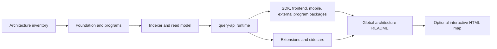
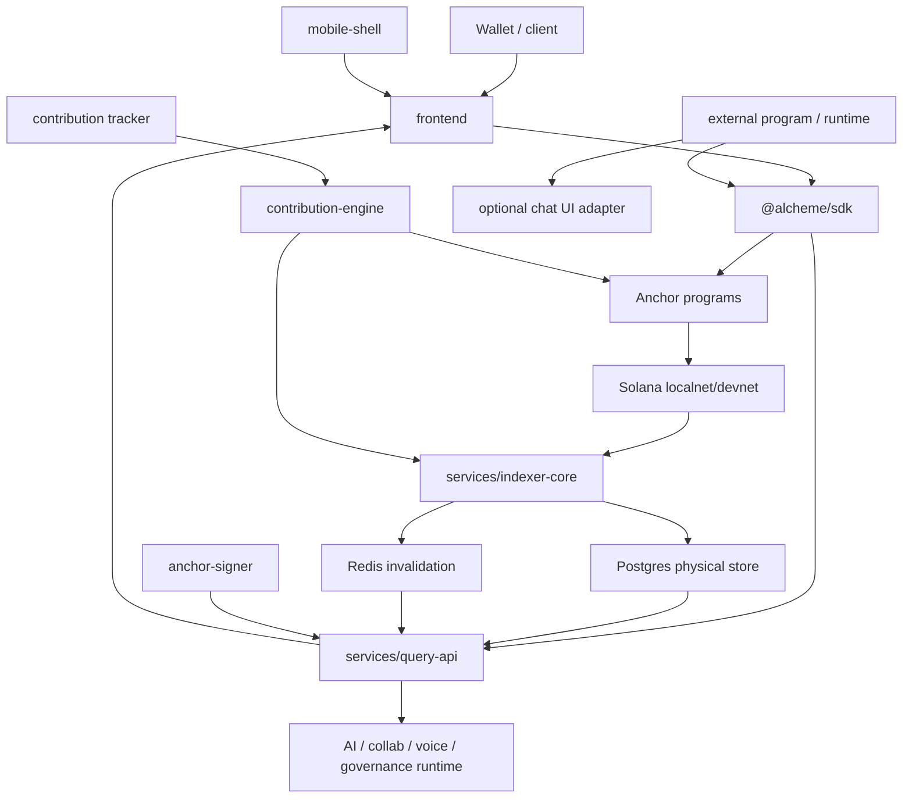

# Architecture Inventory

This inventory is the working index for the diagram-first architecture documentation pass. It lists the repository units that need their own architecture README before the global architecture guide is expanded.

## Diagram Units

| Unit | Path | Type | Primary Evidence | README Target |
| --- | --- | --- | --- | --- |
| Shared Rust foundation | `shared/` | Rust crate | `shared/Cargo.toml`, `shared/src/*.rs` | `shared/README.md` |
| CPI interfaces | `cpi-interfaces/` | Rust crate | `cpi-interfaces/Cargo.toml`, `cpi-interfaces/src/lib.rs` | `cpi-interfaces/README.md` |
| Identity registry program | `programs/identity-registry/` | Anchor program | `programs/identity-registry/src/lib.rs`, `state.rs`, `instructions.rs` | `programs/identity-registry/README.md` |
| Event emitter program | `programs/event-emitter/` | Anchor program | `programs/event-emitter/src/lib.rs`, `state.rs`, `instructions.rs` | `programs/event-emitter/README.md` |
| Access controller program | `programs/access-controller/` | Anchor program | `programs/access-controller/src/lib.rs`, `state.rs`, `instructions.rs`, `validation.rs` | `programs/access-controller/README.md` |
| Content manager program | `programs/content-manager/` | Anchor program | `programs/content-manager/src/lib.rs`, `state.rs`, `instructions.rs`, `storage.rs`, `validation.rs` | `programs/content-manager/README.md` |
| Registry factory program | `programs/registry-factory/` | Anchor program | `programs/registry-factory/src/lib.rs`, `state.rs`, `instructions.rs`, `validation.rs` | `programs/registry-factory/README.md` |
| Messaging manager program | `programs/messaging-manager/` | Anchor program | `programs/messaging-manager/src/lib.rs`, `state.rs`, `instructions.rs`, `validation.rs` | `programs/messaging-manager/README.md` |
| Circle manager program | `programs/circle-manager/` | Anchor program | `programs/circle-manager/src/lib.rs`, `state.rs`, `instructions.rs`, tests | `programs/circle-manager/README.md` |
| Contribution engine program | `extensions/contribution-engine/program/` | Anchor extension program | `extensions/contribution-engine/program/src/lib.rs`, `state.rs`, `instructions/*` | `extensions/contribution-engine/program/README.md` |
| Indexer core | `services/indexer-core/` | Rust service | `services/indexer-core/src/main.rs`, `listeners/*`, `parsers/*`, `database/*` | `services/indexer-core/README.md` |
| Query API | `services/query-api/` | Node runtime/API | `services/query-api/src/index.ts`, `app.ts`, `rest/*`, `graphql/*`, `services/*` | `services/query-api/README.md` |
| Read model schema | `services/query-api/prisma/` | Prisma/Postgres schema | `services/query-api/prisma/schema.prisma` | `services/query-api/prisma/README.md` |
| SDK | `sdk/` | TypeScript package | `sdk/src/alcheme.ts`, `sdk/src/modules/*`, `sdk/src/runtime/*` | `sdk/README.md` |
| Frontend | `frontend/` | Next.js app | `frontend/src/app/*`, `frontend/src/lib/api/*`, `frontend/src/hooks/*`, `frontend/package.json` | `frontend/README.md` |
| Mobile shell | `mobile-shell/` | Capacitor shell | `mobile-shell/package.json`, `mobile-shell/capacitor.config.ts` | `mobile-shell/README.md` |
| Contribution engine extension | `extensions/contribution-engine/` | Extension bundle | `extension.manifest.json`, package scripts, tests | `extensions/contribution-engine/README.md` |
| Contribution tracker | `extensions/contribution-engine/tracker/` | Node service | `tracker/package.json`, `tracker/src/*`, tests | `extensions/contribution-engine/tracker/README.md` |
| Anchor signer | `extensions/anchor-signer/` | Node sidecar | `extensions/anchor-signer/package.json`, `src/server.js` | `extensions/anchor-signer/README.md` |
| External program React communication package | `packages/game-chat-react/` | React package | `packages/game-chat-react/src/index.ts`, existing README | `packages/game-chat-react/README.md` |
| External program headless communication example | `examples/game-chat-headless/` | Example | `examples/game-chat-headless/src/main.ts`, existing README | `examples/game-chat-headless/README.md` |

## Root Orchestration Evidence

| Surface | Evidence | Use In Final Diagram |
| --- | --- | --- |
| Local stack | `scripts/start-local-stack.sh` | Shows the consolidated developer runtime: local RPC, Postgres, Redis, query-api, indexer-core, tracker, frontend, and signer. |
| Container stack | `docker-compose.yml` | Shows Postgres, Redis, indexer-core, query-api, Prometheus, and Grafana. |
| Anchor workspace | `Anchor.toml` | Shows the localnet program set and test script entrypoint. |
| Rust workspace | `Cargo.toml` | Shows core Rust crates and Anchor program members. |
| NPM workspace | `package.json` | Shows root scripts and the `packages/*` workspace. |
| Devnet program IDs | `config/devnet-program-ids.json` | Shows canonical devnet program identities. |
| Consistency covenant | `scripts/check-consistency-covenant.js` | Shows public read-surface versus mutation-authority expectations. |

## Documentation Pass Order

## First Global Shape

This global shape is intentionally preliminary. The final architecture guide should only promote edges that remain true after each subproject README has been written from source evidence.

## Architecture Blind-Spot Checks

| Blind Spot | Why It Matters | Evidence Path | Suggested Next Check |
| --- | --- | --- | --- |
| Public node versus private sidecar split | Prevents accidental mutation authority on public read surfaces. | `services/query-api/src/config/services.ts`, `scripts/check-consistency-covenant.js` | Run the covenant check and inspect sidecar-gated routes. |
| Extension projection lifecycle | Contribution engine spans manifest, program, indexer parser, SDK, tracker, and query-api discovery. | `extensions/contribution-engine/extension.manifest.json`, `services/indexer-core/src/parsers/extensions.rs` | Confirm parser coverage against the manifest event list. |
| Product flow hard gates | Discussion, draft, and crystallization cross frontend, query-api runtime, database, and chain anchors. | `frontend/src/lib/api/*`, `services/query-api/src/rest/*`, `services/query-api/prisma/schema.prisma` | Trace one successful crystallization from UI to receipt. |
| State authority classification | Postgres stores projected chain facts, runtime-owned state, and hybrid rows in one physical database. | `services/query-api/prisma/schema.prisma`, `services/indexer-core/src/database/*`, `services/query-api/src/services/*` | Classify Prisma models as chain-authoritative references, projected, runtime-owned, or hybrid. |
| Local stack differs from production topology | Local scripts consolidate roles for developer speed. | `scripts/start-local-stack.sh`, `docker-compose.yml` | Separate the local convenience map from the intended production map. |
