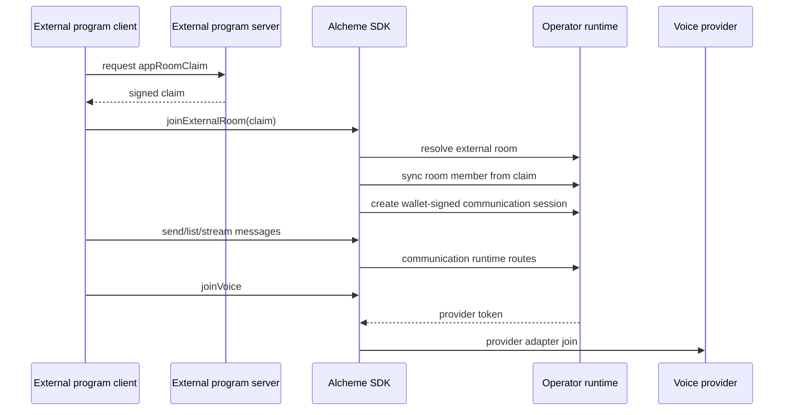

# External Program Communication And Voice Integration

Status: public runtime contract overview for external programs.

This document describes the public integration shape for Alcheme-compatible
communication rooms and voice sessions. It is intentionally separate from
first-party Plaza discussion, draft, proof, and crystallization workflows.

Product terminology: **External Program** is the public term for a third-party
runtime that connects to Alcheme capabilities. The SDK and runtime contract may
still use `ExternalApp` as the implementation object name.

## Current Scope

Implemented public surfaces:

- Resolve deterministic rooms for external program contexts.
- Create wallet-signed communication sessions.
- Send, list, and stream signed text messages.
- Send voice clip messages by referencing externally stored audio.
- Create or reuse voice sessions and receive provider join tokens when the
  operator runtime enables voice.
- Submit selected runtime evidence as SourceMaterial candidates when the
  operator enables community knowledge continuity.
- Fetch accepted knowledge context packages for room UI or server logic.

Not part of this public integration slice:

- Raw audio storage by Alcheme.
- Automatic Plaza discussion post creation.
- Automatic draft generation.
- Automatic crystallization.
- On-chain temporary room, chat, voice-session, or raw-audio state.
- Access to private operator deployment scripts, signing sidecars, or runtime
  internals.

## Runtime Roles

The external program owns its product rules, room semantics, server key, and
client UI.

The operator runtime is the control plane:

- verifies registered external program identity.
- verifies server-signed `appRoomClaim` payloads.
- verifies user wallet signatures.
- stores runtime room, session, and message metadata.
- issues voice provider tokens when voice is enabled.
- enforces room membership, CORS, risk, and capability policy.

The voice provider is the media plane. A provider such as LiveKit carries audio
after the operator runtime issues a short-lived token. The provider does not
make Alcheme room membership authoritative.

The Solana/SVM layer is the proof and settlement layer for registered protocol
paths. Temporary room messages and live voice state are not written to chain by
this integration.

## Minimal Runtime Flow



Use `joinExternalRoom` from `@alcheme/sdk/runtime/communication` when possible.
It performs the room resolve, member sync, and communication session bootstrap in
the required order.

## Required App Room Claim

Production-grade external rooms require an `appRoomClaim` signed by the external
program server. The browser must not hold the server private key.

The claim binds:

- `externalAppId`
- `roomType`
- `externalRoomId`
- wallet pubkeys authorized for the claim
- optional roles and voice policy
- expiry timestamp
- nonce

The server signs the encoded payload with the Ed25519 private key whose public
key is registered on the external program record. Claims that are expired, signed
by the wrong key, scoped to the wrong room, or missing the joining wallet must be
rejected by the runtime.

## Public Route Contract

All routes below are operator-runtime routes under `/api/v1`.

| Flow | Route |
| --- | --- |
| Discover runtime capabilities | `GET /external-apps/runtime-capabilities` |
| Discover stable error contract | `GET /external-apps/error-contract` |
| Check app integration status | `GET /external-apps/:appId/integration-status` |
| Resolve external room | `POST /communication/rooms/resolve` |
| Sync room member | `POST /communication/rooms/:roomKey/members` |
| Create communication session | `POST /communication/sessions` |
| Send text or voice clip message | `POST /communication/rooms/:roomKey/messages` |
| List messages | `GET /communication/rooms/:roomKey/messages` |
| Stream messages | `GET /communication/rooms/:roomKey/stream` |
| Create or reuse voice session | `POST /voice/sessions` |
| Issue voice provider token | `POST /voice/sessions/:sessionId/token` |
| Submit SourceMaterial candidate | `POST /external-apps/:appId/source-materials` |
| Fetch knowledge context | `POST /external-apps/:appId/knowledge-context` |
| Fetch risk-disclaimer terms | `GET /external-apps/risk-disclaimers/:scope` |
| Submit risk-disclaimer receipt | `POST /external-apps/:appId/risk-disclaimer-acceptances` |
| Open production registration request | `POST /external-apps/:appId/production-registration-requests` |

Discovery, integration status, and stability projection are product/read-model
surfaces. Treat them as diagnostics and display facts, not as app authority
shortcuts.

`POST /external-apps/:appId/source-materials` requires an operator runtime that
exposes the `source_materials` private sidecar surface. Production
source-material and knowledge-context requests also require server-signed claims;
see [External Program Server-Signed Claims](./server-signed-claims.md).

## Message And Voice Boundaries

Text messages are signed envelopes stored in runtime communication storage. They
do not create Plaza posts, drafts, crystals, or chain writes by default.

Voice clips reference external storage such as HTTPS, S3, IPFS, or Arweave. The
runtime stores the URI, duration, size, optional caption, and payload digest. It
does not store raw audio bytes.

Live voice requires an injected provider adapter in the external program. The
operator runtime may issue provider tokens only after communication-session and
room-policy checks pass.

## Knowledge Continuity

External program runtime chat and voice are not automatically promoted into
Alcheme knowledge. Reusable knowledge moves through explicit review:

```text
runtime event
  -> source material candidate
  -> Circle policy or governance review
  -> accepted knowledge context
  -> optional first-party draft/proof/crystallization workflows
```

Knowledge context packages return accepted summaries, references, permissions,
cache metadata, and non-endorsement boundaries. They must not expose sealed
evidence, private locators, raw room history, unpublished drafts, or automatic
crystals.

## Verification Checklist

Before calling an external program integration ready:

- The public SDK checks pass in the public baseline.
- The operator has registered the external program and allowed origins.
- The external program server signs short-lived room claims with the registered
  Ed25519 key.
- A browser wallet can create a communication session through `joinExternalRoom`.
- Text send, list, and stream flows work against the target operator endpoint.
- Voice is tested only when the operator voice provider is enabled and healthy.
- SourceMaterial submission is tested only against an endpoint where the
  operator has enabled the `source_materials` private sidecar surface.
- Knowledge context requests use a signed claim that binds the same room, Circle,
  wallet, capability, and purpose as the request.
- Production registration uses manifest hash, owner assertion, developer terms,
  chain receipt evidence, and the `policyEpochId` from
  `GET /external-apps/review-policy/current`.
- No server private key, admin token, program authority key, or settlement
  authority key is shipped to browser code.
