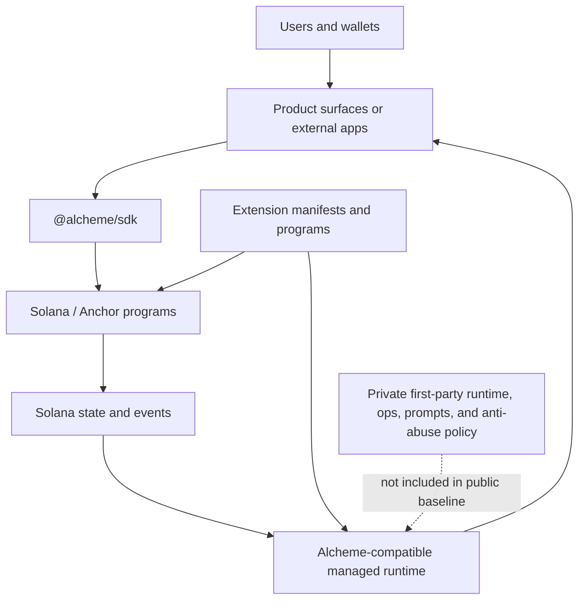

# Alcheme Public Architecture Overview

This document explains what the public baseline is intended to reveal. It is not
a full product runtime map and it is not a deployment runbook.

Static HTML map: [`docs/public-architecture-map.html`](./public-architecture-map.html).

Alcheme separates the open protocol and integration surface from the first-party
managed runtime. The public baseline exposes the parts that external developers,
auditors, and integrators need to inspect: on-chain programs, shared protocol
types, CPI interfaces, SDK code, extension manifests, schemas, quickstarts, and
examples. The internal tree keeps the operational product layer: managed runtime
services, first-party UI, operator indexer/query implementations, signing
sidecars, prompts, evals, anti-abuse policy, rate-limit strategy, deployment
runbooks, and production key-management topology.

## System Shape

The important boundary is that the chain-facing protocol and integration
contracts are public and inspectable, while the managed runtime and operator
projection layer that operate the first-party product are not shipped as part of
this baseline.

## Public Layers

### Protocol Programs

`programs/` contains the Anchor programs that define the public protocol
surface. These programs cover identity, content, access control, circles,
messaging, registry factories, external app registration, and external app
economics.

The programs are public so integrators can audit account layouts, instruction
contracts, authority boundaries, CPI expectations, and emitted events.

### Shared Types And CPI Interfaces

`shared/` and `cpi-interfaces/` contain protocol types and helper interfaces
used across programs. These are public because external programs need stable
types and CPI contracts to integrate correctly.

### TypeScript SDK

`sdk/` provides the public client and server-side helper surface. It wraps
program calls, PDA derivation, transaction helpers, storage helpers, runtime
client types, and external-app signing helpers.

The SDK intentionally includes runtime client types because external
integrations need to know how to talk to an Alcheme-compatible runtime endpoint.
The first-party runtime implementation itself is not part of this public
baseline.

### Extensions

`extensions/contribution-engine/` exposes the public contribution-engine program
surface and manifest. The manifest shows how an Alcheme extension declares
program identity, permissions, event types, parser contracts, projection tables,
and compatibility requirements.

The private tree may include additional tracker and scoring infrastructure. That
operational layer is not required to audit the public program interface and is
not part of this baseline.

### Integration Material

`docs/integration/external-program-quickstart.md`, `docs/schemas/`, `examples/`, and
`packages/game-chat-react/` show how external developers can reason about
Alcheme-compatible integration points without receiving the first-party product
runtime.

## What This Baseline Lets You Evaluate

- Whether the protocol's on-chain boundaries are coherent.
- Whether the SDK exposes enough surface for external programs and clients.
- Whether extension manifests can describe an extension in a stable way.
- Whether external app registration, claims, communication, and voice integration
  have a clear public contract.
- Whether the open protocol layer is credible independent of the private product
  runtime.

## What This Baseline Does Not Provide

- A complete first-party web or mobile product.
- The first-party managed runtime implementation.
- Operator indexer/query implementations and production projection deployments.
- Production signing sidecars or key-management topology.
- Internal prompts, model-evaluation fixtures, anti-abuse rules, or rate-limit
  strategy.
- Deployment runbooks, incident notes, funding material, or private roadmap
  planning.

Those exclusions are intentional. They keep the protocol and integration
contracts open while preserving a commercially defensible product and operations
layer.

## How To Read The Repository

1. Start with `programs/README.md` to see the public protocol modules.
2. Read `sdk/README.md` to understand the client surface.
3. Read `docs/integration/external-program-quickstart.md` for the external app
   path.
4. Inspect `extensions/contribution-engine/` for the extension pattern.
5. Use `docs/public-baseline.md` to understand how the public snapshot is
   generated from the private development tree.

## Contribution Boundary

Public contributions should target protocol, SDK, schema, example, and public
extension surfaces. Changes that require private managed-runtime behavior should
describe the needed contract in the issue or pull request instead of assuming
access to the private tree.
