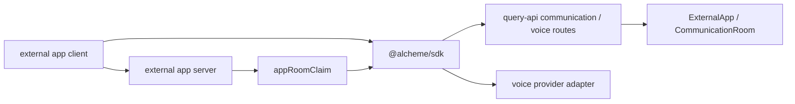
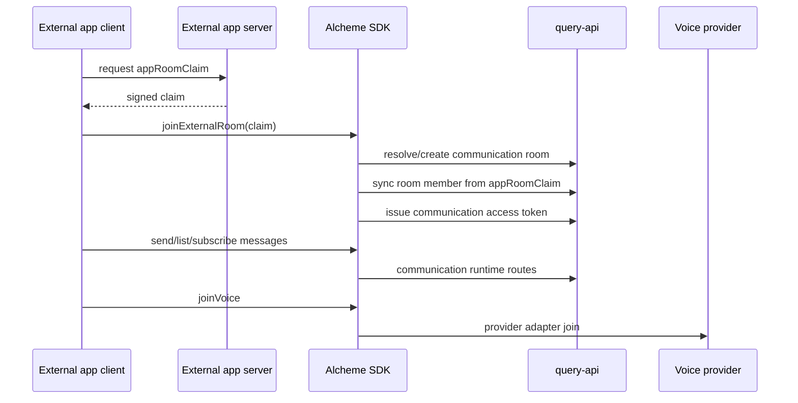

# External App Chat Headless Example

HTML diagram: [Open this subproject map](../../docs/architecture/subproject-maps.html#game-chat-headless).

This example shows the intended SDK-level integration shape for an external app or runtime client.
It is a template, not a runnable app by itself.

The current integration is headless:

- no React UI requirement
- no Plaza dependency
- no audio recording
- no transcript or recap
- no temporary-room chain write

## System Position



## Runtime Flow



## Files

- `src/main.ts`: client-side SDK flow with an injected wallet signer and voice
  provider client.

## Required Runtime Pieces

External app client:

- a wallet object that exposes `publicKey` and `signMessage(message)`
- an Alcheme query-api base URL
- a voice provider adapter if voice is enabled

External app server:

- an `ExternalApp` row in Alcheme
- an Ed25519 server key whose public key is stored on `ExternalApp.serverPublicKey`
- a short-lived `appRoomClaim` for each external room/member sync request

## Minimal Flow

1. Ask the external app server for an `appRoomClaim`.
2. Call `joinExternalRoom` to resolve/create the room, sync membership, and create a wallet-signed communication session.
3. Send/list/stream text and optional voice clip messages.
4. Pass the communication session token to the voice client.
5. Join voice through an injected provider client.

## Running As A Real Example Later

To make this executable, add a small package around this directory and install:

```bash
npm install @alcheme/sdk livekit-client
```

Then replace the example wallet and `voiceProviderClient` in `src/main.ts`
with real browser wallet and LiveKit code.

## Blind Spots To Check

| Question | Evidence Needed |
| --- | --- |
| What should the external app server sign into `appRoomClaim`? | Check query-api communication route validation and SDK runtime types. |
| Which voice provider is used in production-like runs? | Check query-api voice provider config and the injected `VoiceProviderClient`. |
| Which room metadata should external apps persist locally? | Compare `resolveRoom` responses with host runtime state requirements. |
