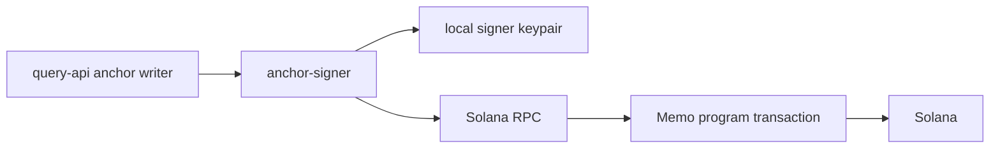
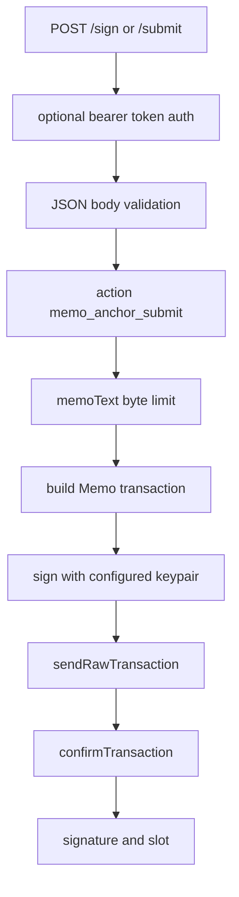

# Anchor Signer Architecture

HTML diagram: [Open this subproject map](../../docs/architecture/subproject-maps.html#anchor-signer).

`extensions/anchor-signer/` is a small Node sidecar that lets `query-api` submit Solana memo-anchor transactions without loading the signer keypair inside the main query-api process.

## System Position

## Request Flow

## Responsibility

- Exposes `GET /health` and `POST /sign` / `POST /submit`.
- Validates action, chain, memo text, signer label, RPC URL, commitment, and memo program ID.
- Signs and submits memo transactions with a configured local keypair.
- Keeps memo-anchor signing isolated from the main query-api runtime.

## Entry Points

| Surface | File or Command |
| --- | --- |
| Service entry | `extensions/anchor-signer/src/server.js` |
| Package manifest | `extensions/anchor-signer/package.json` |
| Start | `cd extensions/anchor-signer && npm run start` |
| Syntax check | `cd extensions/anchor-signer && npm run check` |
| Query API caller | `services/query-api/src/services/anchorSigner.ts` |
| Local stack wiring | `scripts/start-local-stack.sh` |

## Blind Spots To Check

| Question | Evidence Needed |
| --- | --- |
| Which query-api anchor flows use this sidecar today? | Search callers of `services/query-api/src/services/anchorSigner.ts`. |
| Which environments force a specific RPC URL? | Check `ANCHOR_SIGNER_FORCE_RPC_URL` and local stack env wiring. |
| Which signer labels are allowed in production-like runs? | Check `ANCHOR_SIGNER_ALLOWED_SIGNER_LABELS` and request bodies. |
