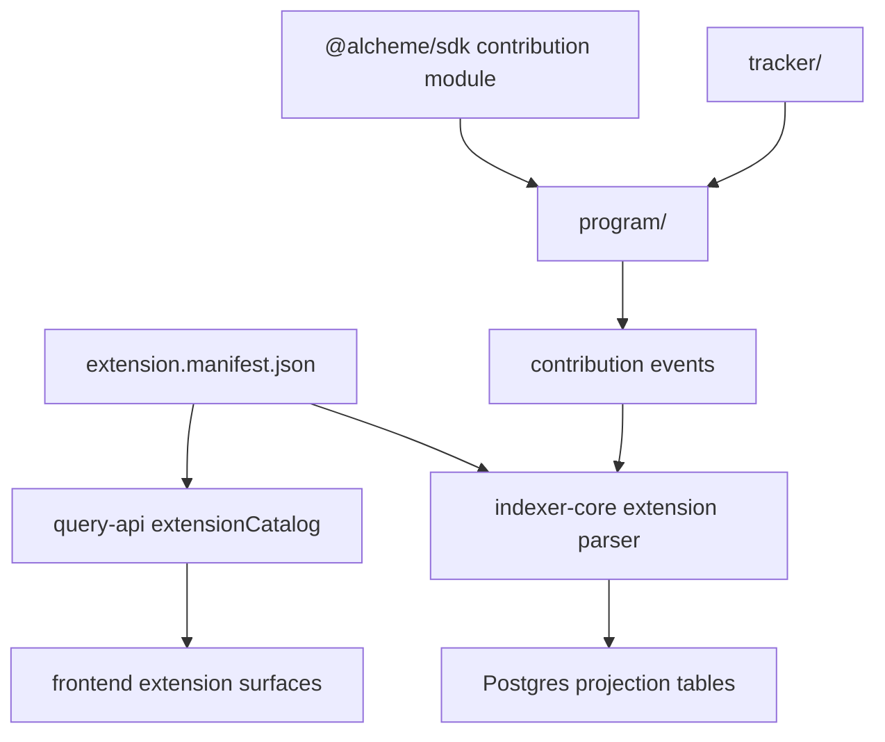
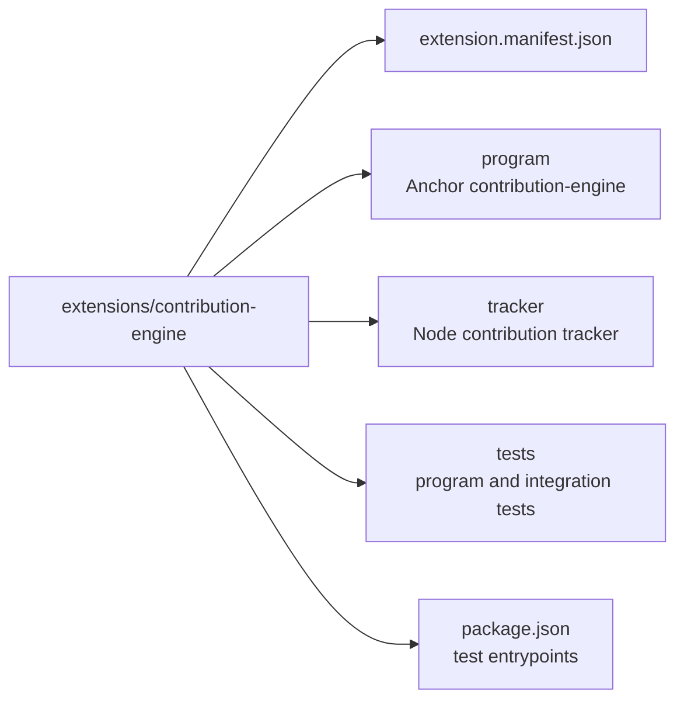

# Contribution Engine Extension Architecture

HTML diagram: [Open this subproject map](../../docs/architecture/subproject-maps.html#contribution-engine).

`extensions/contribution-engine/` is the first-party extension bundle for contribution accounting. It includes the extension manifest, the Anchor extension program, TypeScript tests, and the off-chain tracker service.

## System Position

## Bundle Map

## Responsibility

- Declares extension identity, permissions, event types, parser contract, projection tables, and compatibility requirements.
- Provides the on-chain contribution-engine program.
- Provides the tracker that adapts protocol events into contribution ledgers and optional settlement cycles.
- Provides tests for program behavior, CPI integration, and program-ID sync.

## Entry Points

| Surface | File or Command |
| --- | --- |
| Extension manifest | `extensions/contribution-engine/extension.manifest.json` |
| Extension program | `extensions/contribution-engine/program/` |
| Tracker service | `extensions/contribution-engine/tracker/` |
| Tests | `extensions/contribution-engine/tests/*.ts` |
| Test program | `cd extensions/contribution-engine && npm run test:program` |
| Test tracker | `cd extensions/contribution-engine && npm run test:tracker` |

## Blind Spots To Check

| Question | Evidence Needed |
| --- | --- |
| Which manifest event types are actually emitted by the program? | Compare `extension.manifest.json` with `program/src/*`. |
| Which projection tables exist in schema or migrations? | Compare manifest projection tables with Prisma/schema SQL. |
| Which contribution UI surfaces are active? | Search frontend for contribution-engine entry registry and API clients. |
