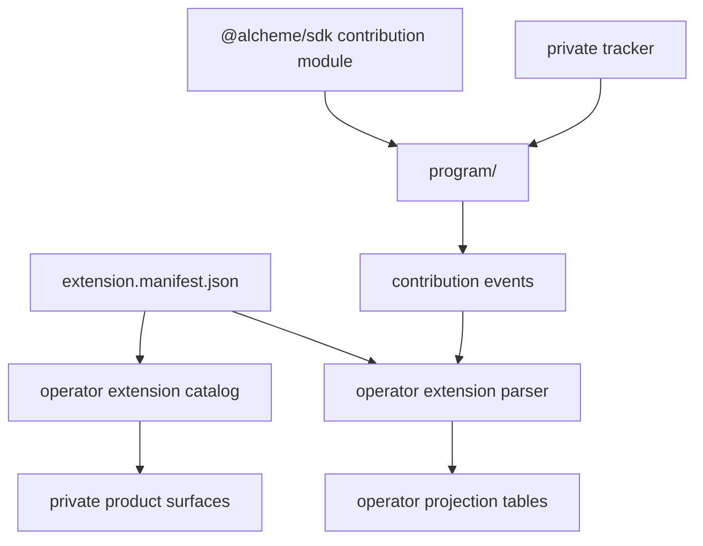
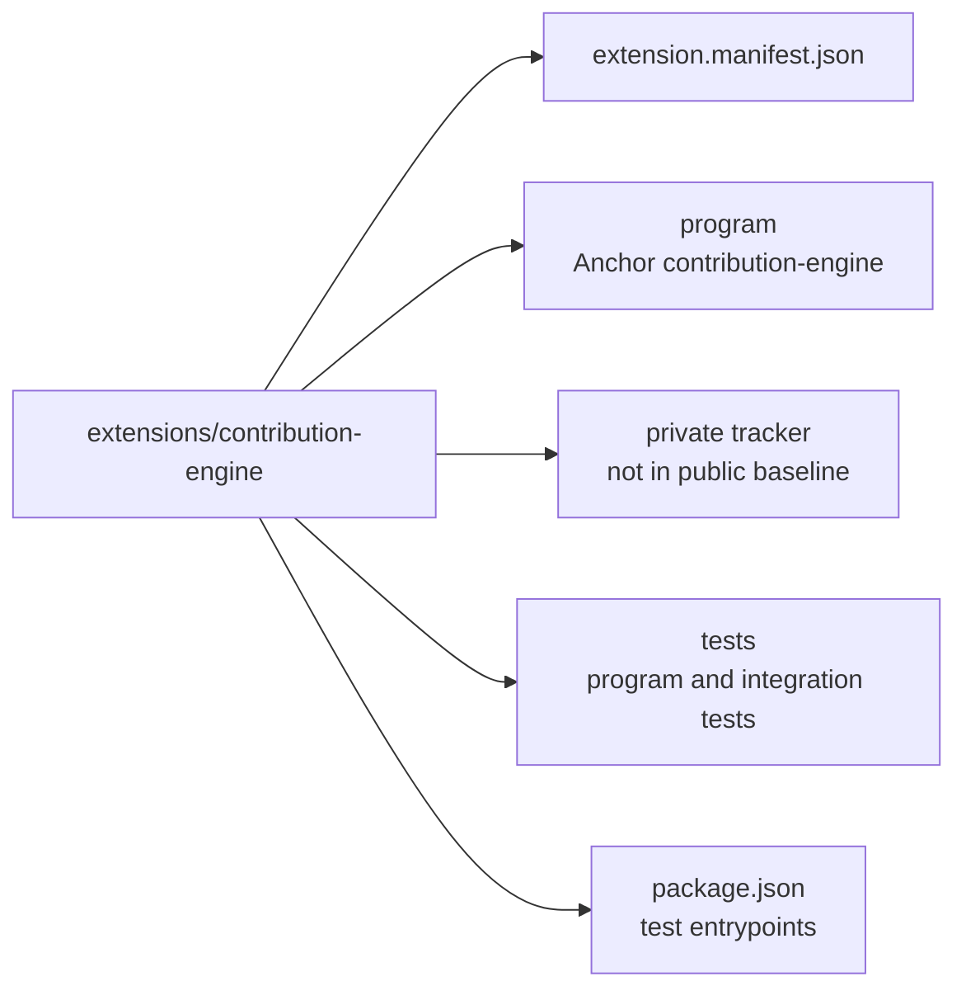

# Contribution Engine Extension Architecture

This file summarizes the contribution-engine surfaces that are safe to include
in the public baseline.

`extensions/contribution-engine/` is the first-party extension bundle for
contribution accounting. The public baseline includes the extension manifest,
the Anchor extension program, and public TypeScript tests. The private
development tree also contains the off-chain tracker service.

## System Position

```mermaid
flowchart TB
    manifest["extension.manifest.json"] --> catalog["operator extension catalog"]
    manifest --> indexer["operator extension parser"]
    sdk["@alcheme/sdk contribution module"] --> program["program/"]
    tracker["private tracker"] --> program
    program --> events["contribution events"]
    events --> indexer
    indexer --> readmodel["operator projection tables"]
    catalog --> product["private product surfaces"]
```

## Bundle Map

```mermaid
flowchart LR
    root["extensions/contribution-engine"] --> manifest["extension.manifest.json"]
    root --> program["program\nAnchor contribution-engine"]
    root --> tracker["private tracker\nnot in public baseline"]
    root --> tests["tests\nprogram and integration tests"]
    root --> package["package.json\ntest entrypoints"]
```

## Responsibility

- Declares extension identity, permissions, event types, parser contract, projection tables, and compatibility requirements.
- Provides the on-chain contribution-engine program.
- In the private tree, provides the tracker that adapts protocol events into
  contribution ledgers and optional settlement cycles.
- Provides public tests for program behavior and CPI integration.

## Entry Points

| Surface | File or Command |
| --- | --- |
| Extension manifest | `extensions/contribution-engine/extension.manifest.json` |
| Extension program | `extensions/contribution-engine/program/` |
| Private tracker service | excluded from the public baseline |
| Public tests | `extensions/contribution-engine/tests/*.ts` |
| Test program | `cd extensions/contribution-engine && npm run test:program` |

## Blind Spots To Check

| Question | Evidence Needed |
| --- | --- |
| Which manifest event types are actually emitted by the program? | Compare `extension.manifest.json` with `program/src/*`. |
| Which projection tables should an operator maintain? | Compare manifest projection tables with the operator projection contract when available. |
| Which contribution UI surfaces are active? | Check the private first-party product tree, not the public baseline. |
