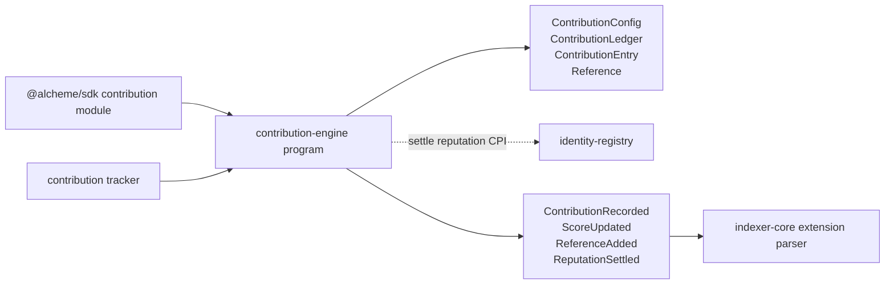
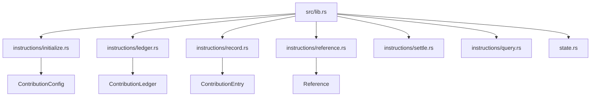

# Contribution Engine Program Architecture

HTML diagram: [Open this subproject map](../../../docs/architecture/subproject-maps.html#contribution-engine-program).

`extensions/contribution-engine/program/` is the official Anchor extension program for contribution ledgers, contribution weights, references, and reputation settlement signals.

## System Position

## Internal Map

## Responsibility

- Initializes contribution-engine configuration and role-weight settings.
- Creates per-crystal contribution ledgers and records contribution entries.
- Adds reference links and supports contribution detail and ledger-summary queries.
- Settles reputation into `identity-registry` through the extension CPI path.

## Entry Points

| Surface | File |
| --- | --- |
| Program module | `extensions/contribution-engine/program/src/lib.rs` |
| State | `extensions/contribution-engine/program/src/state.rs` |
| Instruction modules | `extensions/contribution-engine/program/src/instructions/*.rs` |
| Program tests | `extensions/contribution-engine/tests/*.ts` |
| SDK caller | `sdk/src/modules/contribution-engine.ts` |

## Blind Spots To Check

| Question | Evidence Needed |
| --- | --- |
| Which contribution events are fully parsed into read-model rows? | Compare `extension.manifest.json` event list with `services/indexer-core/src/parsers/extensions.rs`. |
| Which settlement paths execute on-chain today? | Inspect tracker settlement flags and `settle_reputation` tests. |
| Which role weights are product-facing versus internal scoring configuration? | Trace `ContributionRole`, tracker scoring code, and query-api contribution surfaces. |
