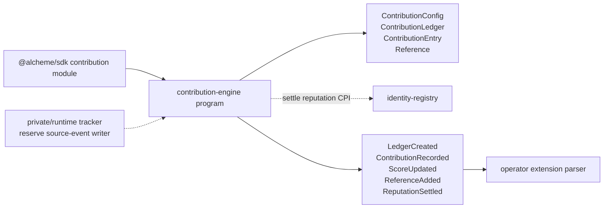
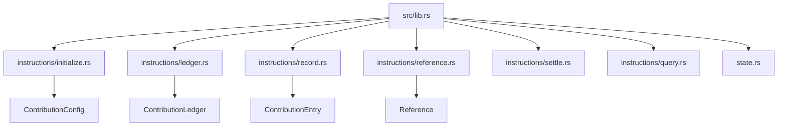

# Contribution Engine Program Architecture

This file documents the public Anchor program surface. Private runtime maps live
outside the public baseline.

`extensions/contribution-engine/program/` is the official Anchor extension program for contribution ledgers, contribution weights, references, and reputation settlement signals.

## System Position

```mermaid
flowchart LR
    sdk["@alcheme/sdk contribution module"] --> program["contribution-engine program"]
    tracker["private/runtime tracker\nreserve source-event writer"] -.-> program
    program --> accounts["ContributionConfig\nContributionLedger\nContributionEntry\nReference"]
    program -. "settle reputation CPI" .-> identity["identity-registry"]
    program --> events["LedgerCreated\nContributionRecorded\nScoreUpdated\nReferenceAdded\nReputationSettled"]
    events --> indexer["operator extension parser"]
```

## Internal Map

```mermaid
flowchart TB
    lib["src/lib.rs"] --> init["instructions/initialize.rs"]
    lib --> ledger["instructions/ledger.rs"]
    lib --> record["instructions/record.rs"]
    lib --> reference["instructions/reference.rs"]
    lib --> settle["instructions/settle.rs"]
    lib --> query["instructions/query.rs"]
    lib --> state["state.rs"]
    init --> config["ContributionConfig"]
    ledger --> ledger_state["ContributionLedger"]
    record --> entry["ContributionEntry"]
    reference --> ref_state["Reference"]
```

## Responsibility

- Initializes contribution-engine configuration and role-weight settings.
- Creates per-crystal contribution ledgers and records contribution entries.
- Adds reference links and supports contribution detail and ledger-summary queries.
- Settles reputation into `identity-registry` through the extension CPI path.

## Current Projection Contract

`ReferenceAdded` is the only current event routed into the read model, where it
writes `knowledge_references`. `ContributionRecorded`,
`ContributionScoreUpdated`, `LedgerCreated`, and `ReputationSettled` are
reserved projection claims until the parser route, db writer, Prisma schema,
read API, and backfill path are implemented.

The private tracker source-event writer is reserved. Current core
`ContentStatusChanged` events do not contain a `CRYSTAL` status or the
contributor arrays required to build contribution ledgers.

## Entry Points

| Surface | File |
| --- | --- |
| Program module | `extensions/contribution-engine/program/src/lib.rs` |
| State | `extensions/contribution-engine/program/src/state.rs` |
| Instruction modules | `extensions/contribution-engine/program/src/instructions/*.rs` |
| Program tests | `extensions/contribution-engine/tests/*.ts` |
| SDK caller | `sdk/src/modules/contribution-engine.ts` |

## Blind Spots To Check

| Question | Evidence Needed |
| --- | --- |
| Which contribution events are fully parsed into read-model rows? | Compare `current_projected_events` with the private runtime parser, writer, and read-model schema when available. |
| Which settlement paths execute on-chain today? | Inspect `settle_reputation` tests and private tracker configuration when available. |
| Which role weights are product-facing versus internal scoring configuration? | Trace `ContributionRole` and private runtime scoring configuration when available. |
