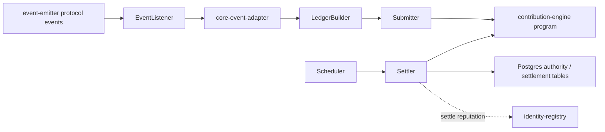
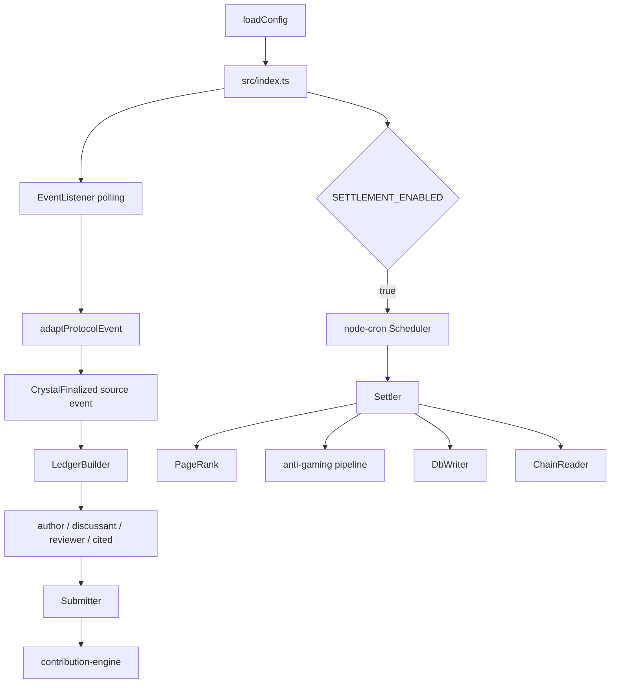

# Contribution Tracker Architecture

HTML diagram: [Open this subproject map](../../../docs/architecture/subproject-maps.html#contribution-tracker).

`extensions/contribution-engine/tracker/` is the off-chain service that listens for contribution source events, builds contribution ledgers, submits them to the contribution-engine program, and can run scheduled reputation settlement.

## System Position

## Runtime Pipeline

## Responsibility

- Watches protocol events that can produce contribution source events.
- Converts crystallization-related events into contribution ledgers.
- Submits contribution entries and references to the on-chain contribution-engine program.
- Optionally runs scheduled PageRank, anti-gaming checks, database writes, and on-chain reputation settlement.

## Entry Points

| Surface | File or Command |
| --- | --- |
| Service entry | `extensions/contribution-engine/tracker/src/index.ts` |
| Config | `extensions/contribution-engine/tracker/src/config.ts` |
| Event adapter | `extensions/contribution-engine/tracker/src/core-event-adapter.ts` |
| Ledger builder | `extensions/contribution-engine/tracker/src/ledger-builder.ts` |
| Submitter | `extensions/contribution-engine/tracker/src/submitter.ts` |
| Settlement | `extensions/contribution-engine/tracker/src/settler.ts`, `src/scheduler.ts` |
| Anti-gaming | `extensions/contribution-engine/tracker/src/anti-gaming/*` |
| Build | `cd extensions/contribution-engine/tracker && npm run build` |
| Tests | `cd extensions/contribution-engine/tracker && npm test` |

## Blind Spots To Check

| Question | Evidence Needed |
| --- | --- |
| Which crystallization event is the canonical source for ledger creation? | Inspect `CONTRIBUTION_SOURCE_PROTOCOL_EVENT_TYPES` and event parser output. |
| Which settlement mode is active in a given environment? | Check `SETTLEMENT_ENABLED` and `SETTLEMENT_EXECUTE_ON_CHAIN`. |
| Which anti-gaming flags are product-visible? | Trace writes from `DbWriter` into query-api and frontend surfaces. |
| Which ledger fields still depend on event payload assumptions? | Inspect `LedgerBuilder` role identification methods. |
