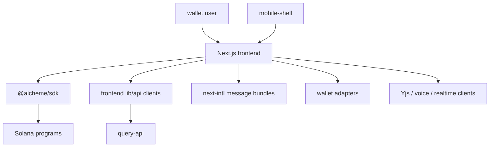
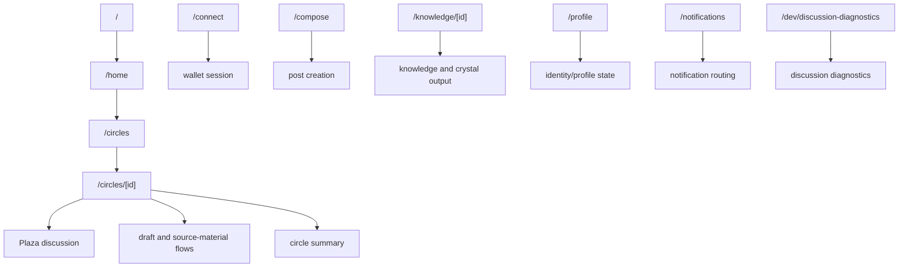
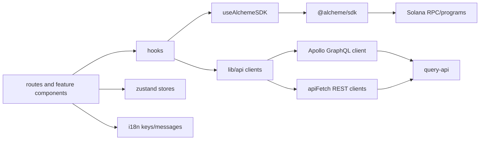

# Frontend Architecture

HTML diagram: [Open this subproject map](../docs/architecture/subproject-maps.html#frontend).

`frontend/` is the Next.js application for the current Alcheme product surfaces: wallet connection, home/feed, circles, discussions, drafts, crystallization, knowledge, notifications, profile, diagnostics, and mobile-shell integration.

## System Position

## Route Map

## Client Data Flow

## Responsibility

- Presents the current product workflow from discussion to draft collaboration to crystallized knowledge.
- Bridges wallet adapters and SDK program writes with query-api runtime/read surfaces.
- Owns user-facing route composition, UI state, i18n messages, and browser/mobile-specific integration.
- Includes browser-only and Playwright tests for route and functional behavior.

## Entry Points

| Surface | File or Command |
| --- | --- |
| Package manifest | `frontend/package.json` |
| App root | `frontend/src/app/layout.tsx`, `frontend/src/app/page.tsx` |
| Main app layout | `frontend/src/app/(main)/layout.tsx` |
| Product routes | `frontend/src/app/(main)/**/page.tsx` |
| API clients | `frontend/src/lib/api/*.ts` |
| SDK hook | `frontend/src/hooks/useAlchemeSDK.ts` |
| i18n messages | `frontend/src/i18n/messages/*.json` |
| Dev server | `cd frontend && npm run dev` |
| Typecheck | `cd frontend && npm run typecheck` |
| Tests | `cd frontend && npm run test:ci` |
| E2E | `cd frontend && npm run test:e2e` |

## Blind Spots To Check

| Question | Evidence Needed |
| --- | --- |
| Which flows write to chain through SDK versus query-api side effects? | Trace hooks and `frontend/src/lib/api/*`. |
| Which pages require private-sidecar APIs? | Compare frontend API clients with query-api sidecar route gates. |
| Which routes are demo-only or diagnostics-only? | Check `frontend/src/app/dev/*`, `/crystal-demo`, and test coverage. |
| Which mobile flows diverge from desktop wallet behavior? | Check `frontend/src/lib/mobile/*`, mobile shell tests, and `mobile-shell/`. |
