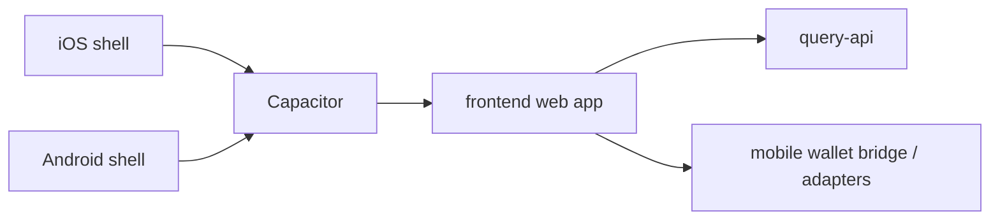
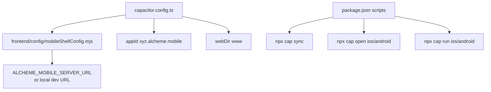

# Mobile Shell Architecture

HTML diagram: [Open this subproject map](../docs/architecture/subproject-maps.html#mobile-shell).

`mobile-shell/` is a Capacitor packaging shell for running the Alcheme frontend in mobile containers. It does not implement a separate product runtime; it points a native shell at the configured frontend server/output.

## System Position

## Internal Map

## Responsibility

- Packages the existing frontend into iOS and Android Capacitor projects.
- Shares mobile server URL resolution with frontend config code.
- Keeps mobile commands in a separate package while frontend scripts proxy common mobile actions.
- Does not own query-api, chain, SDK, or product state.

## Entry Points

| Surface | File or Command |
| --- | --- |
| Capacitor config | `mobile-shell/capacitor.config.ts` |
| Package manifest | `mobile-shell/package.json` |
| iOS project | `mobile-shell/ios/` |
| Android project | `mobile-shell/android/` |
| Web output directory | `mobile-shell/www/` |
| Sync | `cd mobile-shell && npm run sync` |
| Open iOS | `cd mobile-shell && npm run open:ios` |
| Open Android | `cd mobile-shell && npm run open:android` |

## Blind Spots To Check

| Question | Evidence Needed |
| --- | --- |
| Which mobile wallet behavior is native versus web adapter behavior? | Inspect `frontend/src/lib/mobile/*` and wallet adapter tests. |
| Which frontend build output is copied into `www` for release? | Check mobile build scripts and Capacitor sync flow. |
| Which origins must be allowed for LAN or device testing? | Check `mobileShellConfig.mjs` and `allowNavigation` in `capacitor.config.ts`. |
