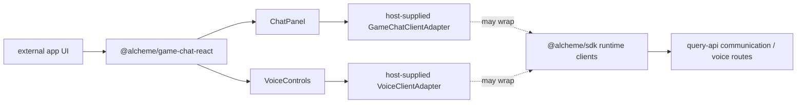
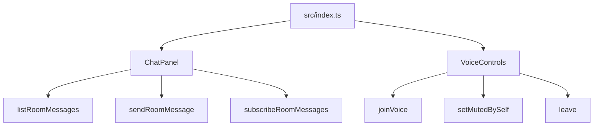

# @alcheme/game-chat-react

HTML diagram: [Open this subproject map](../../docs/architecture/subproject-maps.html#game-chat-react).

Optional React components for external app or runtime integrations that want a simple UI on top of the Alcheme headless communication and voice clients.

This package is intentionally adapter-based. It does not require API users to use React, and it does not import Plaza, draft, semantic, knowledge, transcript, or recap controls.

## System Position



## Component Map



## Responsibility

- Provides optional React UI for chat messages and voice controls.
- Depends on adapters supplied by the host application instead of importing Plaza or Alcheme product UI.
- Keeps external app integrations compatible with headless SDK runtime clients.
- Leaves authentication, wallet signing, room claims, and provider setup to the host application.

## Build

```bash
npm --workspace @alcheme/game-chat-react run build
```

## Components

- `ChatPanel`: message list, composer, send state, and stream reconnect state.
- `VoiceControls`: join/leave, mute/unmute, and participant list.

Pass adapters compatible with the existing headless SDK runtime methods.

## Entry Points

| Surface | File |
| --- | --- |
| Package exports | `packages/game-chat-react/src/index.ts` |
| Chat UI | `packages/game-chat-react/src/ChatPanel.tsx` |
| Voice UI | `packages/game-chat-react/src/VoiceControls.tsx` |
| Build config | `packages/game-chat-react/tsconfig.json` |

## Blind Spots To Check

| Question | Evidence Needed |
| --- | --- |
| Which adapter methods should be treated as stable public API? | Compare `ChatPanel.tsx`, `VoiceControls.tsx`, SDK runtime clients, and external example usage. |
| Which styling contract should host apps expect? | Inspect exported class names and any future CSS package decisions. |
| Which voice provider states need richer UI? | Compare `VoiceConnectionState` with query-api voice provider capabilities. |
