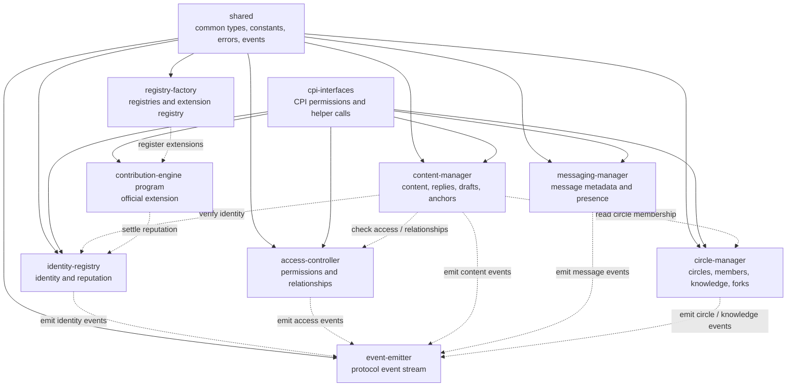

# Program Layer Architecture

HTML diagram: [Open this subproject map](../docs/architecture/subproject-maps.html#programs).

`programs/` contains the core Anchor programs that form the on-chain authority layer for Alcheme. These programs are supported by `shared/` for common protocol vocabulary and `cpi-interfaces/` for cross-program cooperation.

## Contract-Layer Map

## Program Set

| Program | Path | Primary Authority |
| --- | --- | --- |
| Identity Registry | `programs/identity-registry/` | user identity, handles, verification, reputation fields |
| Access Controller | `programs/access-controller/` | permission rules, relationship facts, access checks |
| Content Manager | `programs/content-manager/` | content posts, replies, reposts, quotes, V2 anchors, draft lifecycle anchors |
| Event Emitter | `programs/event-emitter/` | event batches, typed event emission, subscriptions, archive stats |
| Registry Factory | `programs/registry-factory/` | deployed registries, deployment templates, extension registry |
| Messaging Manager | `programs/messaging-manager/` | conversation metadata, message hashes, batches, presence |
| Circle Manager | `programs/circle-manager/` | circle hierarchy, membership, forks, knowledge, transfers, contributor proofs |

## Build And Test Entry Points

| Surface | Command or File |
| --- | --- |
| Anchor workspace | `Anchor.toml` |
| Rust workspace | `Cargo.toml` |
| Build programs | `npm run build` |
| Anchor tests | `npm test` |
| Unit tests | `npm run test:unit` |
| Integration tests | `npm run test:integration` |

## Blind Spots To Check

| Question | Evidence Needed |
| --- | --- |
| Which program relationships are enforced on-chain versus only reflected in read models? | Inspect account constraints and CPI helper calls in `programs/*/src/instructions.rs`. |
| Which events are fully projected by `indexer-core`? | Compare emitted events against `services/indexer-core/src/parsers/*`. |
| Which localnet IDs differ from devnet IDs? | Compare `Anchor.toml` with `config/devnet-program-ids.json`. |
