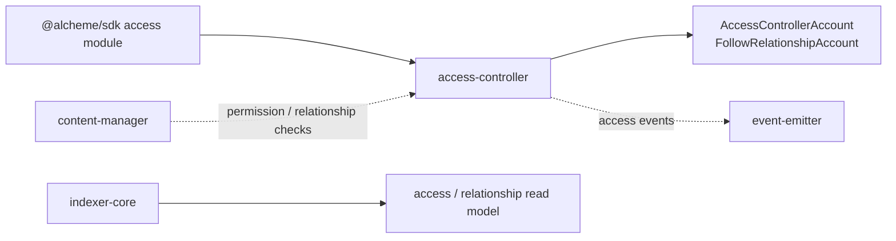
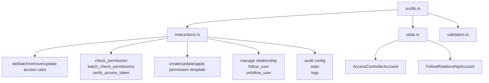

# Access Controller Program Architecture

HTML diagram: [Open this subproject map](../../docs/architecture/subproject-maps.html#access-controller).

`access-controller` owns on-chain permission rules, relationship facts, and permission-check surfaces used by other programs and the runtime.

## System Position

## Internal Map

## Responsibility

- Stores access-controller configuration and minimal follow-relationship facts.
- Provides permission-rule management, token verification, and batch permission checks.
- Emits access-related events through the CPI helper path.
- Supplies relationship facts that content visibility and audience rules can use.

## Entry Points

| Surface | File |
| --- | --- |
| Program module | `programs/access-controller/src/lib.rs` |
| Instructions | `programs/access-controller/src/instructions.rs` |
| State | `programs/access-controller/src/state.rs` |
| Validation | `programs/access-controller/src/validation.rs` |
| SDK caller | `sdk/src/modules/access.ts` |

## Blind Spots To Check

| Question | Evidence Needed |
| --- | --- |
| Which permission checks are enforced before content writes? | Trace `check_permission_simple` callers in `programs/content-manager/src/instructions.rs`. |
| Which access facts are projected into Prisma models? | Compare emitted events with `AccessRule`, `Permission`, and `UserRelationship` in `schema.prisma`. |
| Which audit features are live versus scaffolded? | Search query-api and frontend callers for audit routes and UI. |
