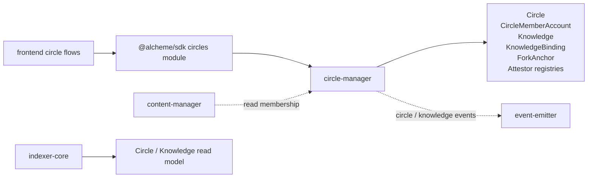
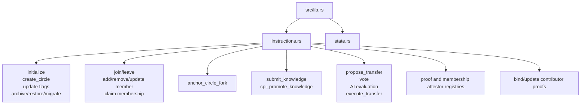

# Circle Manager Program Architecture

HTML diagram: [Open this subproject map](../../docs/architecture/subproject-maps.html#circle-manager).

`circle-manager` owns circle hierarchy, membership, forks, knowledge records, transfer proposals, proof attestors, membership attestors, and contributor-proof bindings.

## System Position

## Internal Map

## Responsibility

- Stores the chain-side circle hierarchy and membership authority facts.
- Anchors fork declarations and knowledge-binding records.
- Manages knowledge submission, transfer proposals, AI evaluation inputs, and transfer execution.
- Provides membership and knowledge authority facts used by content and crystallization flows.

## Entry Points

| Surface | File |
| --- | --- |
| Program module | `programs/circle-manager/src/lib.rs` |
| Instructions | `programs/circle-manager/src/instructions.rs` |
| State | `programs/circle-manager/src/state.rs` |
| Program tests | `programs/circle-manager/tests/*.rs` |
| SDK caller | `sdk/src/modules/circles.ts` |

## Blind Spots To Check

| Question | Evidence Needed |
| --- | --- |
| Which circle hierarchy facts are copied, inherited, or only linked by fork metadata? | Compare `Circle`, `CircleForkAnchor`, `KnowledgeBinding`, and indexer projection. |
| Which membership gates are on-chain versus query-api runtime gates? | Trace `claim_circle_membership`, query-api membership services, and frontend join flows. |
| Which contributor proof bindings are required before crystallization is considered complete? | Trace `bind_contributor_proof`, `bind_and_update_contributors`, and receipt/entitlement code. |
