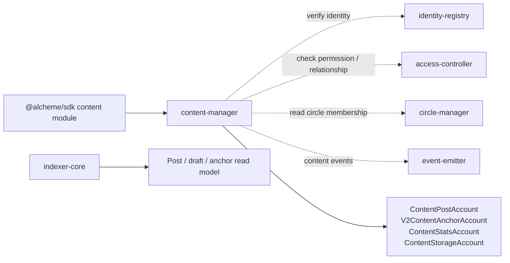
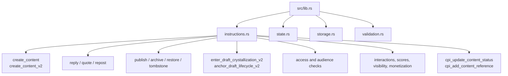

# Content Manager Program Architecture

HTML diagram: [Open this subproject map](../../docs/architecture/subproject-maps.html#content-manager).

`content-manager` owns chain-side content records, interaction metadata, V2 audience/lifecycle fields, and draft/crystallization anchor instructions.

## System Position

## Internal Map

## Responsibility

- Creates and updates chain-side content metadata for posts, replies, reposts, quotes, and drafts.
- Stores V2 anchors and lifecycle/audience fields used by newer product flows.
- Calls identity, access, relationship, and circle-membership helpers for gated writes.
- Emits content events that feed the indexer and query-api read model.

## Entry Points

| Surface | File |
| --- | --- |
| Program module | `programs/content-manager/src/lib.rs` |
| Instructions | `programs/content-manager/src/instructions.rs` |
| State | `programs/content-manager/src/state.rs` |
| Storage helpers | `programs/content-manager/src/storage.rs` |
| Validation | `programs/content-manager/src/validation.rs` |
| SDK caller | `sdk/src/modules/content.ts` |

## Blind Spots To Check

| Question | Evidence Needed |
| --- | --- |
| Which V2 lifecycle states are authoritative on-chain versus query-api runtime state? | Compare V2 anchor instructions with `DraftWorkflowState` and draft routes in `query-api`. |
| Which audience rules are enforced before writes? | Trace `create_content_v2_with_access` and `create_content_v2_with_audience`. |
| Which content events are fully projected? | Compare emitted content events with indexer parser branches and Prisma `Post` fields. |
