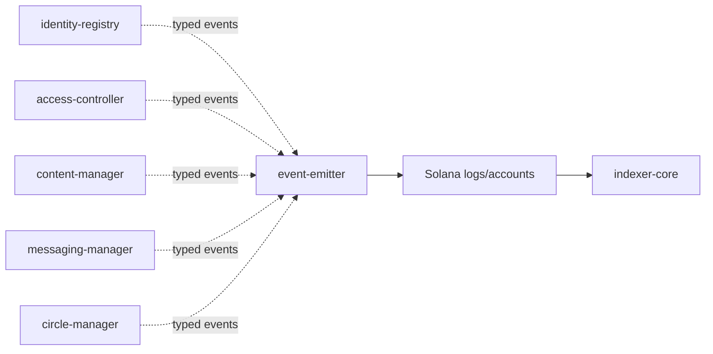
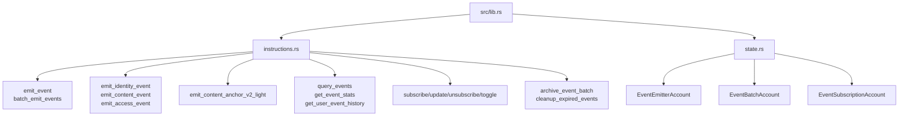

# Event Emitter Program Architecture

HTML diagram: [Open this subproject map](../../docs/architecture/subproject-maps.html#event-emitter).

`event-emitter` is the on-chain event stream program used by core programs to record protocol events that can later be ingested by `indexer-core`.

## System Position

## Internal Map

## Responsibility

- Accepts generic and typed protocol event emission.
- Stores event emitter configuration, event batch accounts, and event subscription accounts.
- Provides event query, stats, subscription, and archive-related instructions.
- Acts as the chain-side bridge between program activity and the indexer projection layer.

## Entry Points

| Surface | File |
| --- | --- |
| Program module | `programs/event-emitter/src/lib.rs` |
| Instructions | `programs/event-emitter/src/instructions.rs` |
| State | `programs/event-emitter/src/state.rs` |
| Event helper callers | `cpi-interfaces/src/lib.rs` |

## Blind Spots To Check

| Question | Evidence Needed |
| --- | --- |
| Which event types are still emitted only as logs versus persisted batches? | Inspect `emit_event` and typed emit instruction implementations. |
| Which emitted events are parsed by `indexer-core`? | Compare event payload names with `services/indexer-core/src/parsers/event_parser.rs`. |
| Which subscription features are product-facing today? | Search frontend and query-api callers for event subscription surfaces. |
