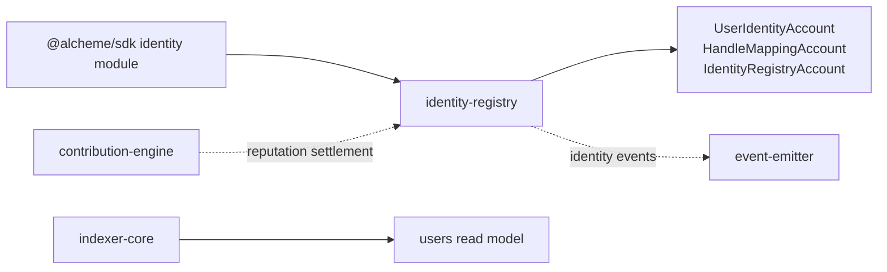
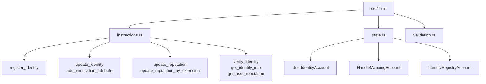

# Identity Registry Program Architecture

HTML diagram: [Open this subproject map](../../docs/architecture/subproject-maps.html#identity-registry).

`identity-registry` owns on-chain identity records, handle mappings, verification attributes, and reputation-related identity fields.

## System Position

## Internal Map

## Responsibility

- Registers and updates user identity records and handle mappings.
- Stores identity profile, verification, reputation, social, economic, and content statistics fields.
- Exposes CPI-style reads for identity verification and reputation lookup.
- Accepts extension-driven reputation updates through the extension reputation path.

## Entry Points

| Surface | File |
| --- | --- |
| Program module | `programs/identity-registry/src/lib.rs` |
| Instructions | `programs/identity-registry/src/instructions.rs` |
| State | `programs/identity-registry/src/state.rs` |
| Validation | `programs/identity-registry/src/validation.rs` |
| SDK caller | `sdk/src/modules/identity.ts` |

## Blind Spots To Check

| Question | Evidence Needed |
| --- | --- |
| Which reputation updates require extension registry authorization? | Trace `update_reputation_by_extension` in `instructions.rs`. |
| Which identity events are projected into `User` rows? | Compare emitted identity events with `services/indexer-core/src/parsers/event_parser.rs`. |
| Which profile fields are duplicated in the off-chain read model? | Compare `UserIdentityAccount` with `services/query-api/prisma/schema.prisma` model `User`. |
