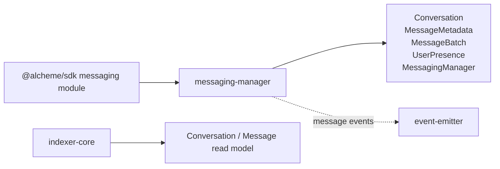
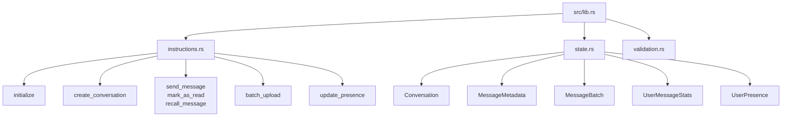

# Messaging Manager Program Architecture

HTML diagram: [Open this subproject map](../../docs/architecture/subproject-maps.html#messaging-manager).

`messaging-manager` stores on-chain message metadata, conversation metadata, batch roots, user presence, and message lifecycle facts.

## System Position

## Internal Map

## Responsibility

- Stores conversation records and message metadata rather than full message bodies.
- Anchors message hashes, storage URIs, reply relationships, batches, read state, recalls, and presence.
- Emits message-related events through the event-emitter helper path.
- Supports the older direct messaging layer separately from the newer query-api communication-room runtime.

## Entry Points

| Surface | File |
| --- | --- |
| Program module | `programs/messaging-manager/src/lib.rs` |
| Instructions | `programs/messaging-manager/src/instructions.rs` |
| State | `programs/messaging-manager/src/state.rs` |
| Validation | `programs/messaging-manager/src/validation.rs` |
| SDK caller | `sdk/src/modules/messaging.ts` |

## Blind Spots To Check

| Question | Evidence Needed |
| --- | --- |
| How much of messaging-manager is used by current product messaging flows? | Compare SDK and frontend callers with query-api communication-room routes. |
| Which message events are projected into Prisma `Conversation` and `Message` rows? | Compare emitted events with indexer parser coverage. |
| Which data remains off-chain by design? | Inspect `storage_uri`, `message_hash`, and batch upload usage. |
