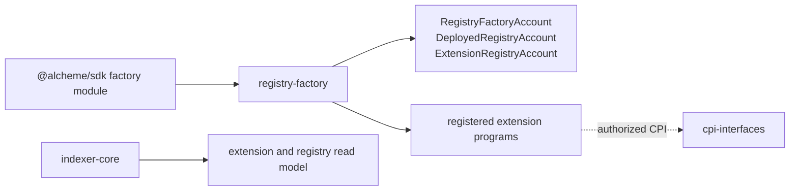
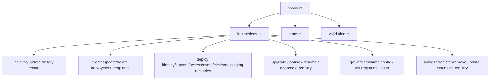

# Registry Factory Program Architecture

HTML diagram: [Open this subproject map](../../docs/architecture/subproject-maps.html#registry-factory).

`registry-factory` owns registry deployment records, deployment templates, version/health metadata, and the extension registry used by extension authorization.

## System Position

## Internal Map

## Responsibility

- Stores registry-factory configuration and deployed registry records.
- Manages deployment templates and lifecycle metadata for registry-like protocol units.
- Owns extension registry accounts that represent which extension programs are registered.
- Provides the registry truth that extension authorization and extension discovery rely on.

## Entry Points

| Surface | File |
| --- | --- |
| Program module | `programs/registry-factory/src/lib.rs` |
| Instructions | `programs/registry-factory/src/instructions.rs` |
| State | `programs/registry-factory/src/state.rs` |
| Validation | `programs/registry-factory/src/validation.rs` |
| SDK caller | `sdk/src/modules/factory.ts` |

## Blind Spots To Check

| Question | Evidence Needed |
| --- | --- |
| Which registry deployment functions create real program instances versus metadata records? | Inspect each deploy instruction implementation and tests. |
| Which extension registry account is used by live extension flows? | Trace registry PDA usage from contribution-engine tests and query-api extension discovery. |
| Which registry events are projected? | Compare factory events with indexer parser coverage. |
