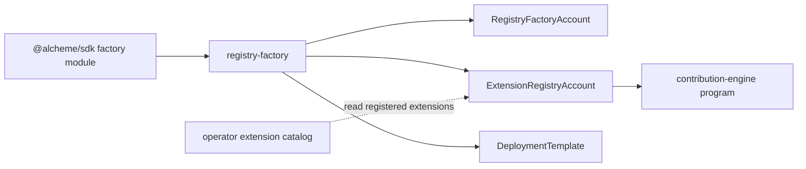
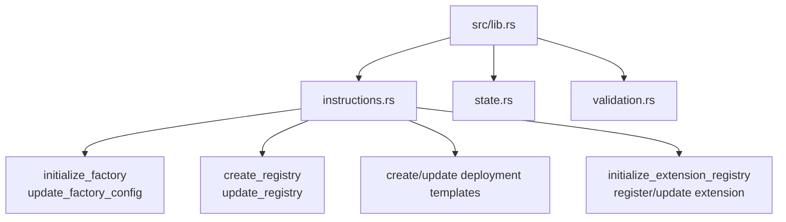

# Registry Factory Program Architecture

HTML diagram: [Open this subproject map](../../docs/architecture/subproject-maps.html#registry-factory).

`registry-factory` owns protocol registry metadata, deployment templates, and
extension registry records used by Alcheme-compatible runtimes.

## System Position

```mermaid
flowchart LR
    sdk["@alcheme/sdk factory module"] --> program["registry-factory"]
    program --> factory["RegistryFactoryAccount"]
    program --> extension["ExtensionRegistryAccount"]
    program --> templates["DeploymentTemplate"]
    extension --> contrib["contribution-engine program"]
    operator["operator extension catalog"] -. "read registered extensions" .-> extension
```

## Internal Map

```mermaid
flowchart TB
    lib["src/lib.rs"] --> ix["instructions.rs"]
    lib --> state["state.rs"]
    lib --> validation["validation.rs"]
    ix --> factory["initialize_factory\nupdate_factory_config"]
    ix --> registry["create_registry\nupdate_registry"]
    ix --> templates["create/update deployment templates"]
    ix --> extensions["initialize_extension_registry\nregister/update extension"]
```

## Responsibility

- Stores registry factory configuration and registry metadata.
- Stores deployment templates and extension registry entries.
- Provides the public on-chain extension registry surface used by official and
  third-party extension programs.
- Leaves operator catalog display, approval workflows, and product policy to the
  runtime layer.

## Entry Points

| Surface | File |
| --- | --- |
| Program module | `programs/registry-factory/src/lib.rs` |
| Instructions | `programs/registry-factory/src/instructions.rs` |
| State | `programs/registry-factory/src/state.rs` |
| Validation | `programs/registry-factory/src/validation.rs` |
| SDK caller | `sdk/src/modules/factory.ts` |

## Blind Spots To Check

| Question | Evidence Needed |
| --- | --- |
| Which registry deployment functions create real program instances versus metadata records? | Inspect each deploy instruction implementation and tests. |
| Which extension registry account is used by live extension flows? | Trace registry PDA usage from public extension tests and operator catalog configuration when available. |
| Which registry events are projected? | Compare factory events with public event payloads and operator projection contracts. |
