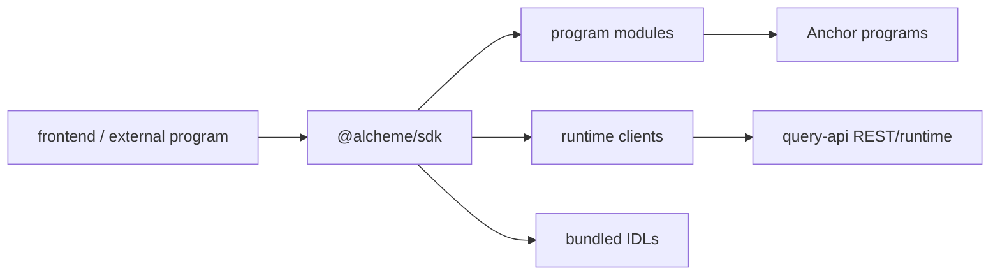
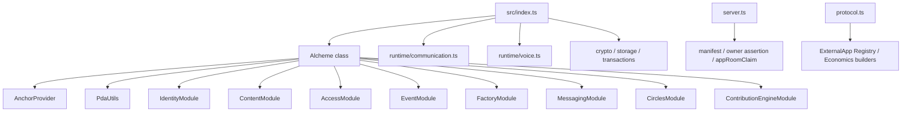

# Alcheme SDK Architecture

HTML diagram: [Open this subproject map](../docs/architecture/subproject-maps.html#sdk).

`sdk/` provides the TypeScript client package for Alcheme. It wraps the Anchor
programs, PDA helpers, transaction helpers, storage helpers, and runtime clients
used by external programs and the first-party frontend.

## System Position



## Internal Map



## Responsibility

- Provides one `Alcheme` client that constructs typed program modules from configured program IDs.
- Bundles IDLs for core programs and the contribution-engine extension.
- Provides runtime clients for communication rooms and voice integrations.
- Provides server-side helpers for manifest hashes, owner assertions, app-room claims, callback digests, evidence hashes, and receipt digests through a server-only subpath.
- Provides protocol transaction helpers and ExternalApp IDL-backed builders through a protocol subpath.
- Installs transaction recovery helpers for already-processed send/confirm cases.

## Entry Points

| Surface | File or Command |
| --- | --- |
| Package manifest | `sdk/package.json` |
| Main client | `sdk/src/alcheme.ts` |
| Exports | `sdk/src/index.ts` |
| Program modules | `sdk/src/modules/*.ts` |
| Runtime clients | `sdk/src/runtime/communication.ts`, `sdk/src/runtime/voice.ts` |
| Server helpers | `sdk/src/server.ts` exported as `@alcheme/sdk/server` |
| Protocol helpers | `sdk/src/protocol.ts` exported as `@alcheme/sdk/protocol` |
| IDLs | `sdk/src/idl/*.json` |
| Build | `cd sdk && npm run build` |
| Tests | `cd sdk && npm test` |
| Runtime subpath check | `cd sdk && npm run check:runtime-imports` |

`@alcheme/sdk/runtime/server` remains as a deprecated compatibility alias for
early external program integrations. New code should import server authority
helpers from `@alcheme/sdk/server`.

## Runtime Subpath Imports

Browser clients should import the runtime surface they need instead of pulling
the root Anchor/Solana SDK entry by default:

```ts
import { createAlchemeGameChatClient } from "@alcheme/sdk/runtime/communication";
import { createAlchemeVoiceClient } from "@alcheme/sdk/runtime/voice";
```

External program servers can build and sign room claims from the server-only helper:

```ts
import {
  computeExternalAppManifestHash,
  computeExternalAppRiskDisclaimerAcceptanceDigest,
  signAppRoomClaim,
  signExternalAppOwnerAssertion,
} from "@alcheme/sdk/server";
```

Protocol builders for ExternalApp registry and economics transactions are exposed
from a separate protocol subpath:

```ts
import {
  buildAnchorExternalAppRegistrationInstruction,
  buildRecordRiskDisclaimerAcceptanceInstruction,
  buildSetAssetAllowlistInstruction,
} from "@alcheme/sdk/protocol";
```

Production ExternalApp registration and participant entry use scoped risk
disclaimer receipts. The app first fetches the terms from Query API, then submits
an on-chain receipt through the ExternalApp Economics program, and finally sends
the receipt evidence back to Query API:

```http
GET /api/v1/external-apps/risk-disclaimers/developer_registration
POST /api/v1/external-apps/:appId/risk-disclaimer-acceptances
```

The chain transaction stores digests, not the full agreement text. For production
registration, the developer agreement acceptance must bind to the manifest hash
and be included as `developerAgreement` when opening the governance request.
External program servers can use `computeExternalAppRiskDisclaimerAcceptanceDigest`
to compute the exact digest that the chain receipt and Query API validation both
expect. The Query API production path verifies the submitted receipt PDA,
on-chain account contents, account-data digest, and transaction status before it
opens the review request.

The root `@alcheme/sdk` export must not be used as a server authority surface.
Browser integrations should use only `runtime/communication`, `runtime/voice`,
and `runtime/errors`.

## Blind Spots To Check

| Question | Evidence Needed |
| --- | --- |
| Which SDK methods still point at legacy program IDs by fallback? | Inspect defaults in `sdk/src/alcheme.ts` and compare with `config/devnet-program-ids.json`. |
| Which runtime clients require query-api private-sidecar routes? | Compare `sdk/src/runtime/*` with `services/query-api/src/rest/index.ts`. |
| Which frontend flows bypass SDK and call query-api directly? | Search `frontend/src/lib/api/*` and hooks. |
