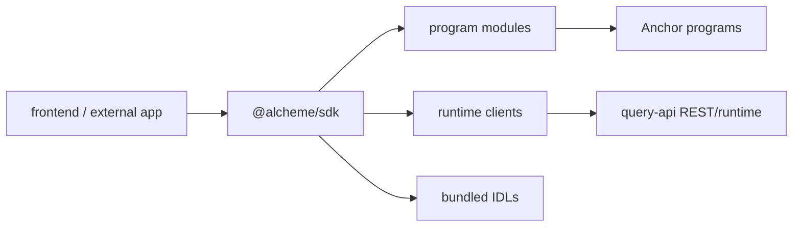
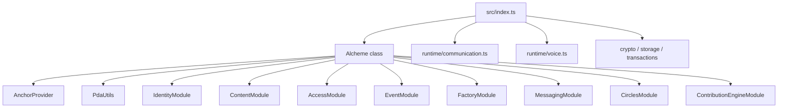

# Alcheme SDK Architecture

HTML diagram: [Open this subproject map](../docs/architecture/subproject-maps.html#sdk).

`sdk/` provides the TypeScript client package for Alcheme. It wraps the Anchor programs, PDA helpers, transaction helpers, storage helpers, and runtime clients used by external apps and the first-party frontend.

## System Position

## Internal Map

## Responsibility

- Provides one `Alcheme` client that constructs typed program modules from configured program IDs.
- Bundles IDLs for core programs and the contribution-engine extension.
- Provides runtime clients for communication rooms and voice integrations.
- Installs transaction recovery helpers for already-processed send/confirm cases.

## Entry Points

| Surface | File or Command |
| --- | --- |
| Package manifest | `sdk/package.json` |
| Main client | `sdk/src/alcheme.ts` |
| Exports | `sdk/src/index.ts` |
| Program modules | `sdk/src/modules/*.ts` |
| Runtime clients | `sdk/src/runtime/communication.ts`, `sdk/src/runtime/voice.ts` |
| IDLs | `sdk/src/idl/*.json` |
| Build | `cd sdk && npm run build` |
| Tests | `cd sdk && npm test` |

## Blind Spots To Check

| Question | Evidence Needed |
| --- | --- |
| Which SDK methods still point at legacy program IDs by fallback? | Inspect defaults in `sdk/src/alcheme.ts` and compare with `config/devnet-program-ids.json`. |
| Which runtime clients require query-api private-sidecar routes? | Compare `sdk/src/runtime/*` with `services/query-api/src/rest/index.ts`. |
| Which frontend flows bypass SDK and call query-api directly? | Search `frontend/src/lib/api/*` and hooks. |
