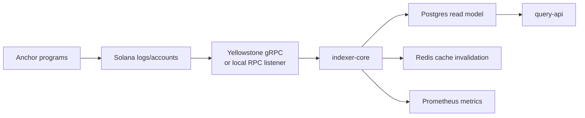
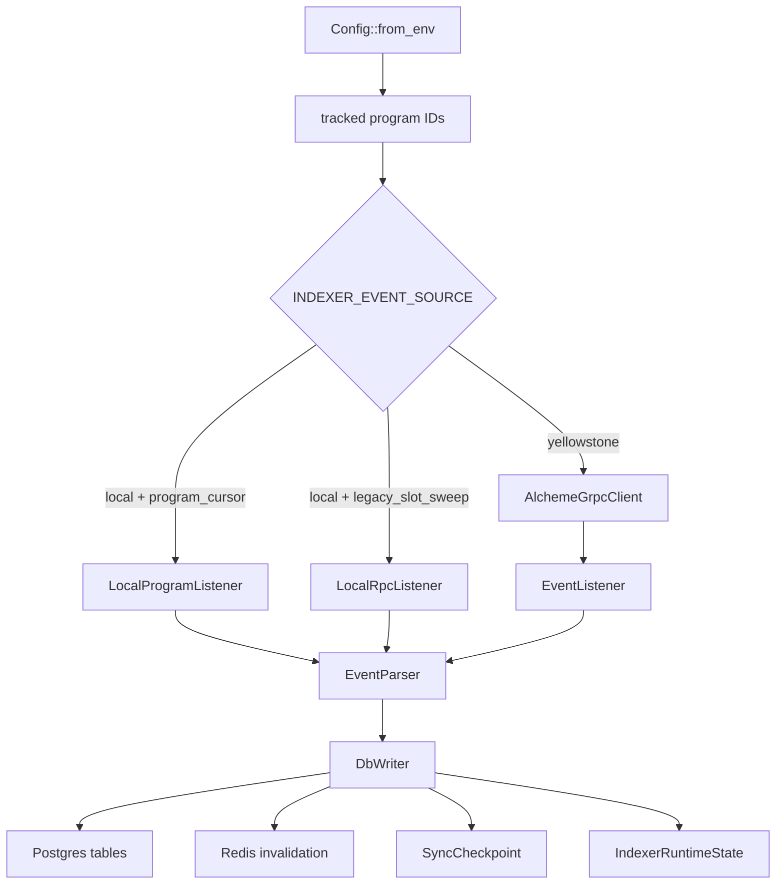

# Indexer Core Architecture

HTML diagram: [Open this subproject map](../../docs/architecture/subproject-maps.html#indexer-core).

`services/indexer-core/` is the Rust projection service that turns Solana program activity into the Postgres read model used by `query-api`.

## System Position

## Runtime Pipeline

## Internal Modules

| Module | Responsibility |
| --- | --- |
| `src/main.rs` | Loads config, starts metrics, creates DB/Redis connections, selects event source, starts listeners. |
| `src/grpc/` | Yellowstone gRPC client integration. |
| `src/listeners/` | Yellowstone event listener, local program-cursor listener, local RPC listener, and local log subscriber. |
| `src/parsers/` | Core event parser and extension parser. |
| `src/database/` | SQL writer, checkpoint manager, runtime state, and projection models. |
| `src/metrics.rs`, `src/metrics_server.rs` | Metrics collection and HTTP metrics server. |

## Responsibility

- Tracks configured core and extension program IDs.
- Reads events from Yellowstone gRPC or local Solana RPC modes.
- Parses event payloads into typed projection operations.
- Writes read-model rows, checkpoint rows, runtime-state rows, and cache invalidation signals.

## Entry Points

| Surface | File or Command |
| --- | --- |
| Binary entry | `services/indexer-core/src/main.rs` |
| Rust package | `services/indexer-core/Cargo.toml` |
| Local env example | `services/indexer-core/.env.example` |
| Docker build | `services/indexer-core/Dockerfile` |
| Local stack startup | `scripts/start-local-stack.sh` |
| Container orchestration | `docker-compose.yml` |

## Blind Spots To Check

| Question | Evidence Needed |
| --- | --- |
| Which emitted program events are not projected yet? | Compare `programs/*/src/instructions.rs` event emissions with `services/indexer-core/src/parsers/event_parser.rs`. |
| Which extension events are projected from manifest truth? | Compare `extensions/contribution-engine/extension.manifest.json` with `services/indexer-core/src/parsers/extensions.rs`. |
| Which local listener mode is safe for a target environment? | Check `INDEXER_EVENT_SOURCE`, `LOCAL_LISTENER_MODE`, and the production guard in `src/main.rs`. |
| Which read-model rows can become stale? | Inspect `SyncCheckpoint`, `IndexerRuntimeState`, and `/sync/status` in `query-api`. |
