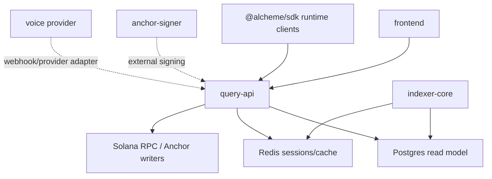
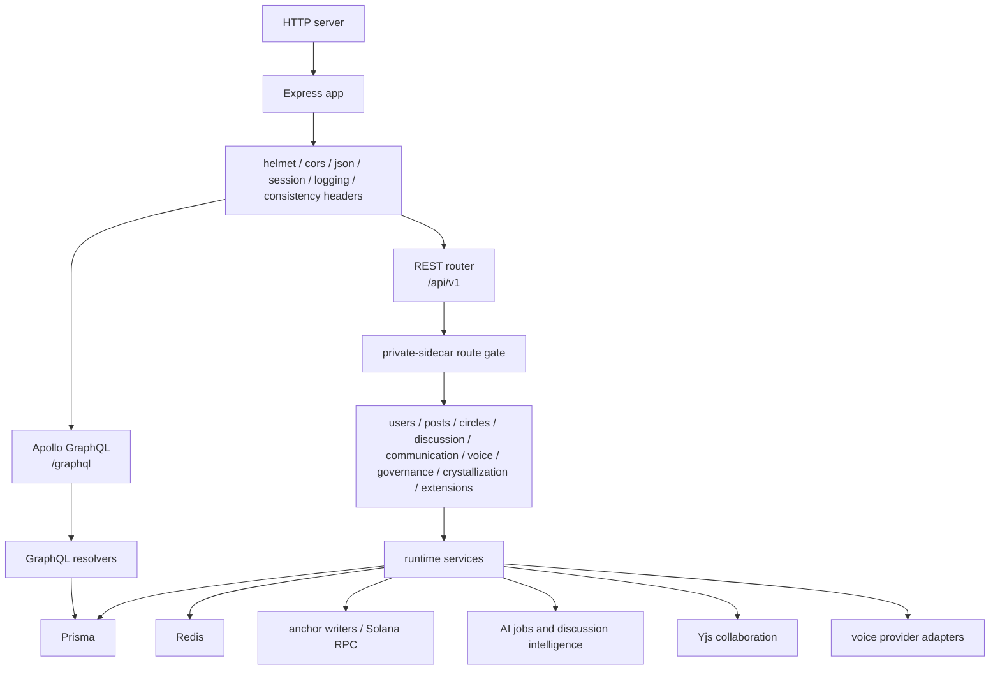
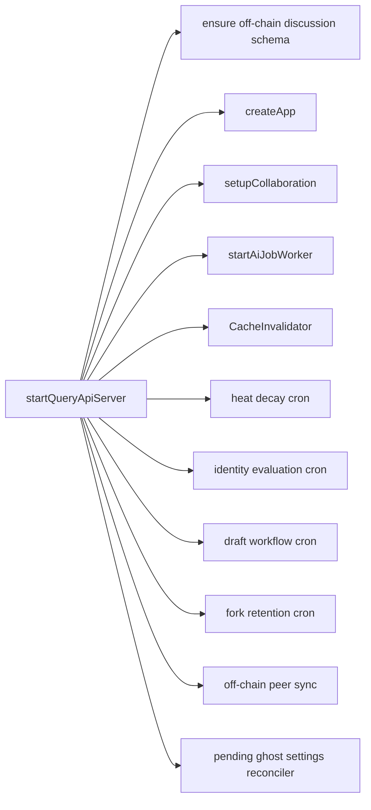
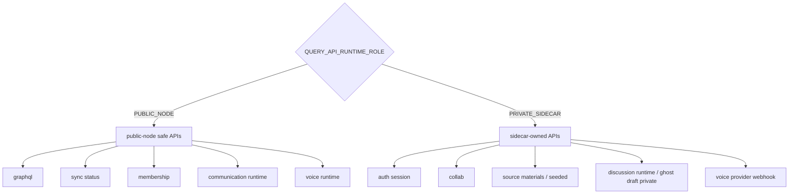

# Query API Architecture

HTML diagram: [Open this subproject map](../../docs/architecture/subproject-maps.html#query-api).

`services/query-api/` is the Node runtime host for Alcheme. It serves GraphQL and REST read/write surfaces, but it also owns runtime services such as discussion, collaboration, AI jobs, voice, governance, draft workflow, crystallization side effects, and private sidecar routes.

## System Position

## Request And Runtime Map

## Background Services

## API Surface Split

## Responsibility

- Serves the GraphQL schema and REST API used by the frontend.
- Reads and writes the Prisma-backed read model and runtime state.
- Hosts private runtime services that are not pure read APIs.
- Enforces public-node versus private-sidecar ownership for sensitive routes.
- Starts background workers and cron jobs needed for current product flows.

## Entry Points

| Surface | File or Command |
| --- | --- |
| Server startup | `services/query-api/src/index.ts` |
| Express/Apollo app | `services/query-api/src/app.ts` |
| REST router | `services/query-api/src/rest/index.ts` |
| GraphQL schema/resolvers | `services/query-api/src/graphql/schema.ts`, `services/query-api/src/graphql/resolvers.ts` |
| Runtime config | `services/query-api/src/config/services.ts` |
| Prisma schema | `services/query-api/prisma/schema.prisma` |
| Build | `cd services/query-api && npm run build` |
| Tests | `cd services/query-api && npm test` |
| MCP server | `cd services/query-api && npm run mcp` |

## Major Runtime Domains

| Domain | Key Paths |
| --- | --- |
| Discussion and ghost drafts | `src/rest/discussion.ts`, `src/ai/*`, `src/services/discussion/*`, `src/services/ghostDraft/*` |
| Draft lifecycle and proof packages | `src/rest/draftLifecycle.ts`, `src/services/draftLifecycle/*`, `src/services/proofPackage*` |
| Crystallization and crystal assets | `src/rest/crystallization.ts`, `src/services/crystallization*`, `src/services/crystalAssets/*`, `src/services/crystalEntitlements/*` |
| Communication rooms and voice | `src/rest/communication.ts`, `src/rest/voice.ts`, `src/services/communication/*`, `src/services/voice/*` |
| Governance and policy | `src/rest/governance.ts`, `src/rest/policy.ts`, `src/services/governance/*`, `src/services/policy/*` |
| Extension discovery | `src/rest/extensions.ts`, `src/services/extensionCatalog.ts` |
| Consistency and sync | `src/services/consistency.ts`, `src/services/offchainPeerSync.ts`, `/sync/status` |

## Blind Spots To Check

| Question | Evidence Needed |
| --- | --- |
| Which routes are safe on public nodes? | Check `publicNodeSafeApis`, `sidecarOwnedApis`, and route matchers in `src/rest/index.ts`. |
| Which runtime writes are chain-authoritative versus read-model side effects? | Trace services that call Solana RPC, anchor writers, or `anchorSigner`. |
| Which background workers are required for a demo to stay healthy? | Check `startQueryApiServer` and local stack process management. |
| Which GraphQL fields still read legacy projections? | Compare `src/graphql/resolvers.ts` with Prisma model groups. |
