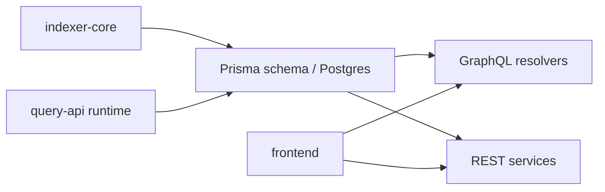
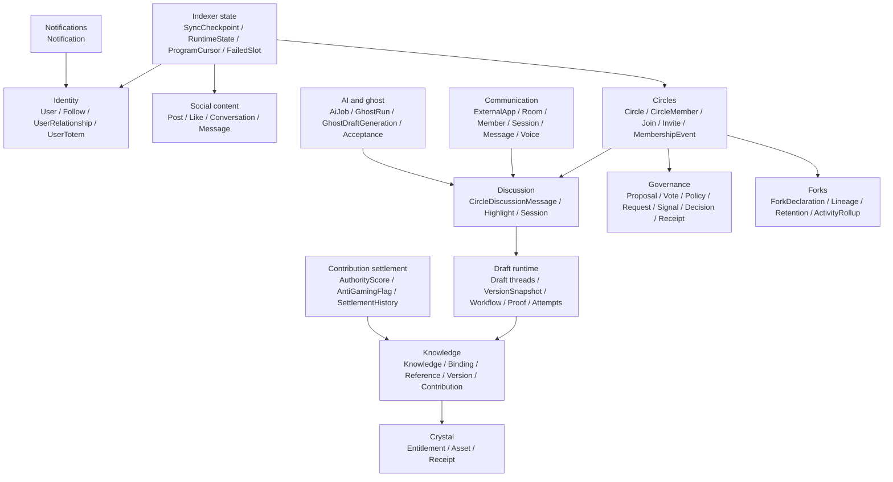
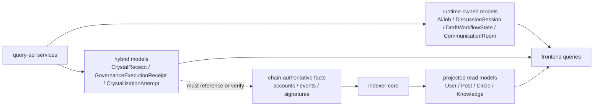

# Query API Prisma Schema Architecture

HTML diagram: [Open this subproject map](../../../docs/architecture/subproject-maps.html#prisma).

`services/query-api/prisma/schema.prisma` defines the Postgres read model and runtime-state model used by `query-api`. It is not just an indexer mirror: it also stores off-chain runtime state for discussion, drafts, collaboration-adjacent flows, governance, AI jobs, communication, voice, and crystallization.

## System Position

## Domain Model Map

## Chain Projection Versus Runtime State

## Ownership Reading

| Ownership | Write Path | Typical Models | Rule Of Thumb |
| --- | --- | --- | --- |
| Chain-authoritative | Anchor programs, signatures, and emitted events. | Source accounts and protocol anchors outside Prisma. | Canonical truth lives on-chain; Prisma can cache or reference it, not replace it. |
| Projected read model | `services/indexer-core/src/database/*`. | `User`, `Post`, `Circle`, `Knowledge`, sync and cursor models. | If it can be rebuilt from chain events, the indexer should own the write. |
| Runtime-owned state | `services/query-api/src/services/*`, `src/rest/*`, workers, and cron jobs. | `AiJob`, `DiscussionSession`, `DraftWorkflowState`, `CommunicationRoom`, `VoiceSession`, governance workflow rows. | If `query-api` creates, schedules, reconciles, or expires it, it is runtime-owned. |
| Hybrid state | `query-api` writes plus chain proof or anchor verification. | `CrystalReceipt`, `GovernanceExecutionReceipt`, crystallization attempt and binding records. | A row is only valid if its referenced chain fact or signature still matches. |

## Model Groups

| Group | Models |
| --- | --- |
| Identity and profile | `User`, `Follow`, `UserRelationship`, `UserTotem` |
| Social content | `Post`, `Like`, `Conversation`, `ConversationParticipant`, `Message` |
| Circles and membership | `Circle`, `CircleMember`, `CircleJoinRequest`, `CircleInvite`, `CircleMembershipEvent` |
| Indexer health | `SyncCheckpoint`, `IndexerRuntimeState`, `IndexerProgramCursor`, `IndexerFailedSlot` |
| Discussion runtime | `CircleDiscussionMessage`, `DiscussionMessageHighlight`, `DiscussionSession` |
| Communication and voice | `ExternalApp`, `CommunicationRoom`, `CommunicationRoomMember`, `CommunicationSession`, `CommunicationMessage`, `VoiceSession`, `VoiceParticipant` |
| Draft and proof runtime | `DraftDiscussionThread`, `DraftDiscussionMessage`, `DraftVersionSnapshot`, `DraftWorkflowState`, `DraftProofPackage`, `DraftCrystallizationAttempt` |
| Governance and policy | `GovernanceProposal`, `GovernanceVote`, `GovernancePolicy`, `GovernancePolicyVersion`, `GovernanceRequest`, `GovernanceDecision`, `GovernanceExecutionReceipt`, `CirclePolicyProfile` |
| Fork and revision direction | `ForkDeclaration`, `CircleForkLineage`, `CircleForkRetentionState`, `CircleActivityRollup`, `RevisionDirectionProposal`, `TemporaryEditGrant` |
| Knowledge and crystals | `Knowledge`, `KnowledgeBinding`, `KnowledgeReference`, `KnowledgeVersionEvent`, `KnowledgeContribution`, `CrystalEntitlement`, `CrystalAsset`, `CrystalReceipt` |
| AI and ghost drafts | `GhostRun`, `CircleGhostSetting`, `PendingCircleGhostSetting`, `GhostDraftGeneration`, `GhostDraftAcceptance`, `DraftCandidateAcceptance`, `DraftCandidateGenerationAttempt`, `AiJob` |
| Contribution settlement | `AuthorityScore`, `AntiGamingFlag`, `SettlementHistory` |
| Notifications and access | `Notification`, `AccessRule`, `Permission`, `TokenTransaction` |

## Entry Points

| Surface | File or Command |
| --- | --- |
| Prisma schema | `services/query-api/prisma/schema.prisma` |
| Prisma client generation | `cd services/query-api && npm run prisma:generate` |
| Prisma migration | `cd services/query-api && npm run prisma:migrate` |
| Query API database client | `services/query-api/src/database.ts` |
| Indexer writer | `services/indexer-core/src/database/*` |

## Blind Spots To Check

| Question | Evidence Needed |
| --- | --- |
| Which models are projected only by the indexer? | Trace writes in `services/indexer-core/src/database/*`. |
| Which models are query-api runtime state? | Trace `prisma.*` writes in `services/query-api/src/services/*` and `src/rest/*`. |
| Which models duplicate on-chain account fields? | Compare Prisma fields with `programs/*/src/state.rs`. |
| Which runtime models need retention or cleanup policies? | Inspect cron services and models with lifecycle or timestamp fields. |
