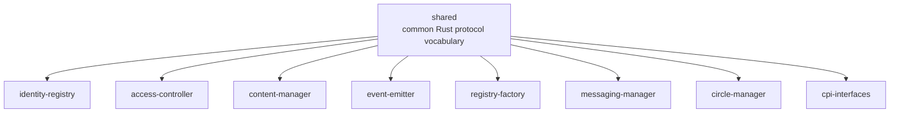
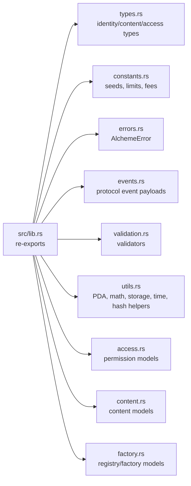

# Shared Crate Architecture

HTML diagram: [Open this subproject map](../docs/architecture/subproject-maps.html#shared).

`shared/` is the Rust foundation crate used by the on-chain programs. It carries the common protocol vocabulary: account data shapes, constants, validation helpers, event payloads, error types, and utility functions.

## System Position

## Internal Map

## Responsibility

- Defines shared protocol data types used by multiple Anchor programs.
- Centralizes seeds, limits, fee constants, validation rules, and error mapping.
- Re-exports common modules from `src/lib.rs` so programs can import one crate.
- Does not own runtime state by itself; it is a dependency of the program layer.

## Entry Points

| Surface | File |
| --- | --- |
| Crate root and re-exports | `shared/src/lib.rs` |
| Protocol constants and seeds | `shared/src/constants.rs` |
| Common account and payload types | `shared/src/types.rs`, `shared/src/content.rs`, `shared/src/access.rs`, `shared/src/factory.rs` |
| Event payloads | `shared/src/events.rs` |
| Validation helpers | `shared/src/validation.rs` |
| Program errors | `shared/src/errors.rs` |

## Blind Spots To Check

| Question | Evidence Needed |
| --- | --- |
| Which constants are still legacy defaults versus deployed program truth? | Compare `shared/src/constants.rs`, `Anchor.toml`, and `config/devnet-program-ids.json`. |
| Which shared types are actively serialized on-chain? | Cross-check each type against account fields in `programs/*/src/state.rs`. |
| Which validation helpers are actually enforced by instructions? | Search callers in `programs/*/src/instructions.rs`. |
